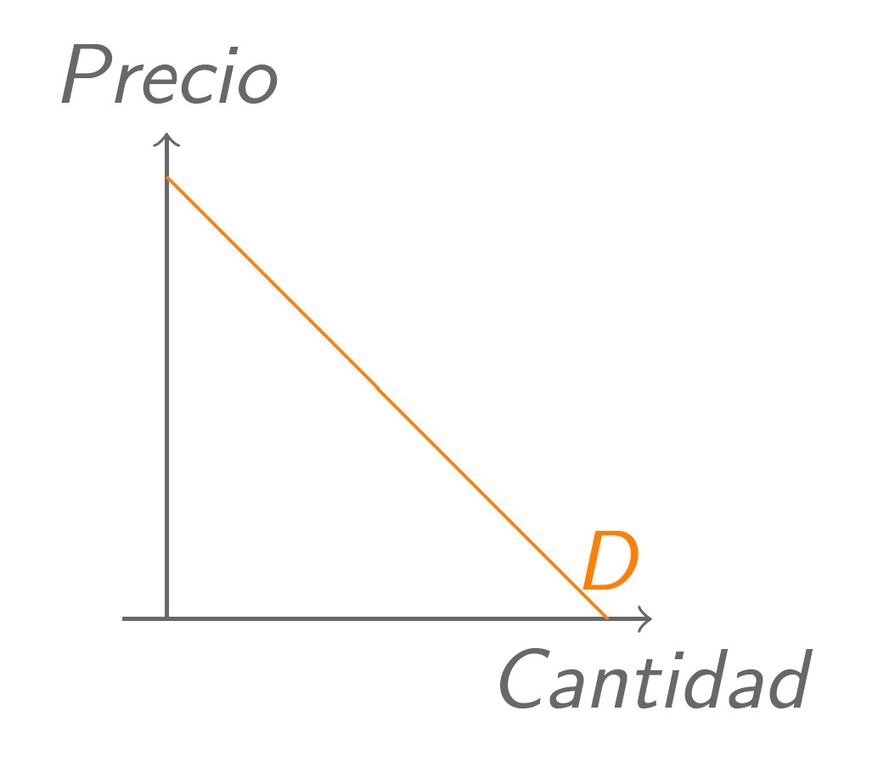

```{r setup, include = FALSE}
library(knitr)                              # paquete que trae funciones utiles para R Markdown
library(tidyverse)                          # paquete que trae varios paquetes comunes en el tidyverse
library(datos)                              # paquete que viene con datos populares traducidos al español :)
library(shiny)
# opciones predeterminadas
knitr::opts_chunk$set(echo = FALSE,         # FALSE: los bloques de código NO se muestran
                      dpi = 300,            # asegura gráficos de alta resolución
                      warning = FALSE,      # los mensajes de advertencia NO se muestran
                      error = FALSE)        # los mensajes de error NO se muestran


options(htmltools.dir.version = FALSE)
```

class: inverse, left, bottom
background-image: url("img/fondo.jpg")
background-size: cover


# **`r rmarkdown::metadata$title`**
----

## **`r rmarkdown::metadata$subtitle`**

### `r rmarkdown::metadata$author`
### `r rmarkdown::metadata$date`

```{r xaringanExtra-share-again, echo=FALSE}
xaringanExtra::use_share_again()
```

```{r xaringanExtra-clipboard, echo=FALSE}
xaringanExtra::use_clipboard()
```

---
name: hola
class: inverse, middle, center


# Pontificia Universidad Javeriana de Cali

--

## Programa de Economía
---


.pull-left[

<br><br><br><br><br>

```{r echo=FALSE, out.width = "110%" }
knitr::include_graphics("img/gif1.gif")
```
]

<br><br><br><br><br>


.pull-right[
# Orlando Joaqui-Barandica
### [www.joaquibarandica.com](https://www.joaquibarandica.com)
 *PhD.(C) in Industrial Engineering* 
 
 *MSc. Applied Economics*
 
 *BSc. Statistics*
]

---

name: menu
background-image: url("img/back2.jpg")
background-size: cover
class: left, middle, inverse

# Contenido

----


.pull-left[
### `r icon("sort-numeric-up")` [Casos](#Casos)

### `r icon("upload")` [¿Qué es la econometría?](#Econometria)

### `r icon("broom")` [Metodología de la Econometría](#Metodologia)

]


.pull-right[


]

---


name: Casos
class: inverse, center, middle

# `r icon("sort-numeric-up")`
# CASOS
----

.right[
.bottom[
####  [`r icon("bell")`](#menu)
]
]

---


# Casos


.pull-left[

* .font110[Imagine que el gobierno lo contrata para evaluar la efectividad de un programa de capacitación para el trabajo financiado con fondos públicos. Suponga que se trata de un programa para instruir a los trabajadores sobre diversas maneras de utilizar las computadoras en los procesos de fabricación.]


* .font110[Este programa, de veinte semanas, ofrece cursos en horarios fuera de la jornada laboral. Cualquier trabajador de la industria puede participar e inscribirse de manera voluntaria a todo el programa o a una parte de él. ]

]

.pull-right[

.center[ 
### Usted tiene que determinar si este programa de capacitación laboral tiene algún efecto sobre los posteriores salarios por hora de los trabajadores.


.orange[.font180[**¿Qué hacer?**]]]


]


---


class: center, middle

### En este caso no se necesita una teoría económica formal. Una comprensión básica de la economía es suficiente para advertir que factores tales como la educación, la experiencia y la capacitación laboral afectan la productividad de los trabajadores.

--


### Los economistas saben que a los trabajadores se les paga en razón de su productividad

--

.brand-charcoal[.font150[$$salario = f(educ, exper, capacitación)$$]]


.left[
Dónde,

- *salario* =  Salario por hora
- *educ* = años de escolaridad formal
- *exper* =  años de experiencia
- *capacitación* = semanas de capacitación laboral
]

.gray[.right[Claramente hay otros factores que influyen, <br> pero este planteamiento encierra la escencia del problema]]

---

class: center, middle, inverse
background-image: url(https://media.giphy.com/media/42HJ26S7bvbmVhcaR2/giphy.gif)
background-size: cover

# Qué características tiene cada una de las variables identificadas?

<br>

.white[.font180[$$salario = f(educ, exper, capacitación)$$]]


---


# Casos


* .font150[Un proyecto de investigación de la alcaldía de Cali quiere establecer los factores que influyen en que un ciudadano utilice o no el servicio del MIO.. ]

.center[.orange[.font180[**¿Qué hacer?**]]]

--

<br>

* .font150[El mismo proyecto anterior tiene una variante en su etapa IV de desarrollo. Ahora, se quiere establecer qué factores influyen para que un ciudadano se movilice en Moto, Carro y Servicio Público (Bus, MIO, Etc)...] 

.center[.orange[.font180[**¿Qué hacer?**]]]


---


# Casos


* .font150[Se desea modelar la percepción de la última feria de Cali realizada en el 2017, la cuál fue evaluada mediante una encuesta socioeconómica, en dónde los encuestados calificaron entre `Muy buena`, `Buena`, `Regular` y `Mala`.]

.center[.orange[.font180[**¿Qué hacer?**]]]

--

<br>

* .font150[El observatorio económico regional tiene el principal interés de evaluar cuales son los factores que determinan la decisión de estudiar y trabajar de manera simultánea en los ciudadanos.] 

.center[.orange[.font180[**¿Qué hacer?**]]]


---


# Casos


* .font150[La responsabilidad social corporativa es un factor muy importante para las empresas. Por tal motivo las empresas divulgan información de sus actividades de tipo medio ambiental, laboral, comunidad, entre otras, año tras año. ¿Qué factores inciden en la divulgación de información de RSC de las empresas durante los años 2015 a 2018?]

.center[.orange[.font180[**¿Qué hacer?**]]]


---


name: Econometria
class: inverse, center, middle

# `r icon("upload")`
# ¿Qué es la econometría?
----

.right[
.bottom[
####  [`r icon("bell")`](#menu)
]
]

---

# Qué es la econometría?


.font120[En términos literales la `econometría` significa `medición económica`.]

.pull-left[
> .font120[`"La econometría, resultado de cierta perspectiva sobre el papel que desempeña la economía, consiste en la aplicación de la estadística matemática a los datos económicos para dar soporte empírico a los modelos construidos por la economía matemática y obtener resultados numéricos."`]

]

.pull-right[


]


<br>

*". . . la econometría puede definirse como el análisis cuantitativo de fenómenos económicos reales, basados en el desarrollo simultáneo de la teoría y la observación, relacionados mediante métodos apropiados de inferencia."*


---

# Qué es la econometría?


.font120[En términos literales la `econometría` significa `medición económica`.]

<br>

----
> *"El método de la investigación econométrica busca en esencia una conjunción entre la teoría económica y la medición real, con la teoría y la técnica de la inferencia estadística como puente."*

----

<br>

.left-col[.center[**Teoría Económica**]]
.center-col[.center[**Estadística**]]
.right-col[.center[**Medición Real**]]


<br>
<br>

.center[

## Relación entre la teoría económica y la medición real (datos) haciendo uso de la estadística.

]

---


# Qué es la econometría?


## Quienes intervienen?


> **La teoría económica** hace afirmaciones o formula hipótesis de naturaleza sobre todo cualitativa.

<br>

----

.pull-left[

<br>
> Por ejemplo, la teoría microeconómica establece que, si no intervienen otros factores, se espera que la reducción del precio de un bien aumente la cantidad demandada de ese bien. Así, la teoría económica postula una relación negativa o inversa entre el precio y la cantidad demandada de un bien.
]


.pull-right[



]

---

# Qué es la econometría?


## Quienes intervienen?


> **La teoría económica** hace afirmaciones o formula hipótesis de naturaleza sobre todo cualitativa.

<br>

----

.pull-left[

.right[

]

]


.pull-right[
<br>
> Pero la teoría por sí sola no proporciona medida numérica alguna de la relación entre los dos; no dice cuánto aumentará o se reducirá la cantidad como resultado de un cambio determinado en el precio del bien.

]


---

# Qué es la econometría?


## Quienes intervienen?

`r icon::fa("link", animate = "passing")` .font130[La economía matemática expresa la teoría económica en una forma matemática (ecuaciones) sin preocuparse por la capacidad de medición o de verificación empírica de la teoría.]

`r icon::fa("link", animate = "passing")`  .font130[La estadística económica se relaciona en primer lugar con la recopilación, procesamiento y presentación de cifras económicas en forma de gráficos y tablas.]

.pull-left-narrow[


]

.pull-left-wide[
<br>
... Pero el estadístico económico no va más allá de la recolección de información, pues no le conciernen las cifras recopiladas para probar las teorías económicas. Sin duda, es el econometrista quien se ocupa de realizar esta labor 💪💪💪.
]

---


# Qué es la econometría?


## En la econometría...

.center[.green[.font130[**Los datos provienen de la observación más que de la experimentación**]]]

Esto tiene dos implicaciones importantes para la creación empírica 
de modelos en econometría.

--

<br> 
> .orange[.font140[**Primero,**]] se requiere que quien elabore modelos domine distintas habilidades en comparación con las que se necesitan para analizar los datos experimentales...


.font180[.center[🔜 .purple[**Intuición económica**]]]


> .orange[.font140[**Segundo,**]] la separación de quien recopila los datos y el analista exige que quien elabora modelos se familiarice por completo con la naturaleza y la estructura de los datos en cuestión.

---


name: Metodologia
class: inverse, center, middle

# `r icon("broom")`
# Metodología de la econometría
----

.right[
.bottom[
####  [`r icon("bell")`](#menu)
]
]

---

class: center, middle, inverse
background-image: url(https://media.giphy.com/media/YK257LnLWgGR2/giphy.gif)
background-size: cover


# ¿Cómo proceden los econometristas en el análisis de un problema económico? 

#Es decir, ¿cuál es su metodología?

---

# Metodología de la econometría


.font140[
> 1. .orange[Planteamiento de la teoría o de la hipótesis.]

> 2. Especificación del modelo matemático de la teoría.

> 3. .orange[Especificación del modelo econométrico o estadístico de la teoría.]

> 4. Obtención de datos.

> 5. .orange[Estimación de los parámetros del modelo econométrico.]

> 6. Pruebas de hipótesis.

> 7. .orange[Pronóstico o predicción.]

> 8. Utilización del modelo para fines de control o de políticas.
]


---


# 1. Planteamiento de la teoría o de la hipótesis.


## Keynes plantea:

.font120[.orange[La ley psicológica fundamental… consiste en que los hombres [y las mujeres], como regla general y en promedio, están dispuestos a incrementar su consumo a medida que aumenta su ingreso, pero no en la misma cuantía del aumento en su ingreso.]]


.pull-left[
----
### En pocas palabras, Keynes postula que la *propensión marginal a consumir* (PMC), es decir, la tasa de cambio del consumo generado por una unidad (digamos, un dólar) de cambio en el ingreso, es mayor que cero pero menor que uno.
----
]


.pull-right[
.center[

]]


---


# 2. Especificación del modelo matemático de la teoría.


## Keynes plantea:

.font120[.green[A pesar de haber postulado una relación positiva entre el consumo y el ingreso, Keynes no especifica la forma precisa de la relación funcional entre ambas cosas. Por simplicidad, un economista matemático puede proponer la siguiente forma de la función keynesiana de consumo:]]

.font140[$$Y = \beta_0 + \beta_1X$$]

donde $Y$ = gasto de consumo y $X$ = ingreso. El coeficiente de la pendiente $\beta_1$ mide la PMC. 

.center[
### Esta ecuación plantea que el consumo esta relacionado linealmente con el ingreso, y es un ejemplo de un modelo matemático de la relación entre consumo e ingreso, llamada en economía función  consumo.
]

---

# 3. Especificación del modelo econométrico o estadístico de la teoría.

.font120[Para dar cabida a relaciones inexactas entre las variables económicas, el econometrista modificaría la función determinista de consumo en la ecuación de la siguiente manera:]

<br>

.font140[$$Y = \beta_0 + \beta_1X + u$$]

u: Término de perturbación o de error, <br>
Variable aleatoria con propiedades probabilísticas bien definidas. 

<br>

.font140[*El término de perturbación $u$ representa* **.orange[todos los factores]** *que afectan el consumo pero que* **no se consideran en el modelo en forma explícita**.]

---

# 4. Obtención de datos

.font140[Para estimar el modelo econométrico se deben obtener los valores numéricos de] $\beta_0$ y $\beta_1$, .font140[para esto son necesarios los datos.]


.pull-left[
<br>

----

.orange[.font180[Ejemplo:]] .font120[se utilizan cifras relacionadas con la economía de Estados Unidos de 1960 a 2005. La variable *Y* es el gasto de consumo personal (GCP) agregado (para la economía en su conjunto), y la variable *X*, el producto interno bruto (PIB), una medida del ingreso agregado, ambos medidos en miles de millones de dólares base año 2000.]

----

]


.pull-right[
.center[

]]


---


# 5. Estimación de los parámetros del modelo econométrico.

.font120[El análisis de regresión es la herramienta principal para obtener las estimaciones. Con esta técnica y los datos obtuvimos los siguientes valores estimados de] $\beta_0$ y $\beta_1$, .font120[a saber, -299.5913 y 0.7218. Así, la función consumo estimada es]

<br>

.font140[$$\hat{Y} = -299.5913 + 0.7218X$$]

>El coeficiente de la pendiente (es decir, la PMC) fue de alrededor de 0.72, lo que indica que:

<br>

### Para el periodo muestral un incremento de un dólar en el ingreso real produjo, en promedio, un incremento cercano a 72 centavos en el gasto de consumo real. Decimos en **promedio** porque la relación entre consumo e ingreso es inexacta.


---

# 6. Pruebas de Hipótesis

.font120[En el supuesto de que el modelo ajustado sea una aproximación razonablemente buena de la realidad, tenemos que establecer criterios apropiados para comprobar si los valores estimados obtenidos, por ejemplo, concuerdan con las expectativas de la teoría que estamos probando.]

<br>

.center[
##Keynes esperaba que la PMC fuera positiva pero menor que 1. 
]

.font120[.orange[**En el ejemplo observamos que la PMC es alrededor de 0.72.** Pero antes de aceptar este resultado como confirmación de la teoría keynesiana de consumo, debemos averiguar si esta estimación está lo bastante abajo de la unidad para convencernos de que no se trata de un suceso debido al azar o de una peculiaridad de los datos.] 

**En otras palabras,** ¿Es 0.72 estadísticamente menor que 1? Si lo es, puede apoyar la teoría de Keynes.]


---

# 7. Pronóstico o predicción.

.font120[Suponga que queremos predecir la media del gasto de consumo para 2006. El valor del PIB para 2006 fue de 11 319.4 millones de dólares.]

.font140[$$\hat{Y}_{2006} = -299.5913 + 0.7218(11319.4) = 7870.75$$]

----

> Con ese valor del PIB, la media o el promedio del gasto de consumo previsto es de alrededor de 7 870 millones de dólares. El valor real del gasto de consumo registrado en 2006 fue de 8 044 millones de dólares. 

----

.pull-left[
### El modelo estimado subpredijo el gasto de consumo real por casi 174 000 millones de dólares.]

.pull-right[
Se diría que el error de predicción es de aproximadamente 174 000 millones de dólares, que representa alrededor de 1.5% del valor real del PIB para 2006.
]

---

# 8. Utilización del modelo para fines de control o de políticas.

.center[

]

.center[
### Un modelo estimado sirve para fines de control o de políticas públicas. Mediante una mezcla apropiada de política fiscal y monetaria, el gobierno puede manejar la variable de control X para producir el nivel deseado de la variable objetivo Y.
]


---

class: center, upper

# Actividad


### Seleccione un país de su preferencia (Que no sea USA) y compruebe el planteamiento de Keynes.

# .orange[¿La propensión marginal a consumir es positiva pero menor que 1?]

---

class: inverse, center, middle
background-color: #122140

.pull-left[

.center[
<br><br>

# Gracias!!!

<br>


### ¿Preguntas?

<br>


```{r qr, echo=FALSE, fig.align="center", out.width="49%"}
knitr::include_graphics("img/qr-code.png")
```


]


]


.pull-right[

<br> 
<br> 


### [www.joaquibarandica.com](https://www.joaquibarandica.com)

`r icon("envelope")` orlando.joaqui@javerianacali.edu.co


]


<br><br><br>


