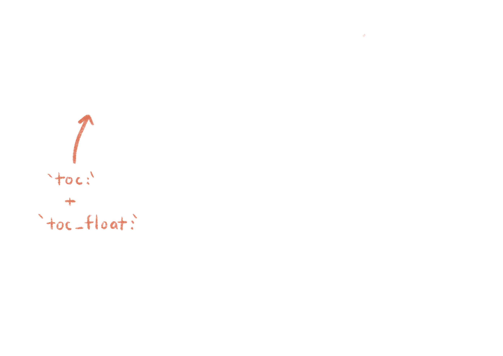
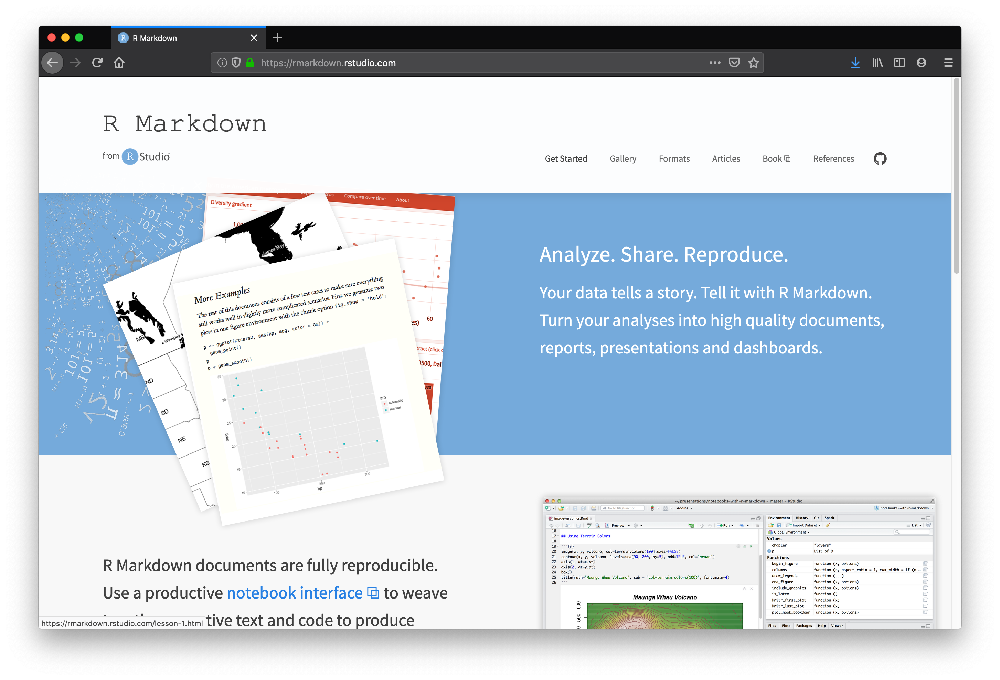

```{r setup, include = FALSE}
library(knitr)                              # paquete que trae funciones utiles para R Markdown
library(tidyverse)                          # paquete que trae varios paquetes comunes en el tidyverse
library(datos)                              # paquete que viene con datos populares traducidos al español :)
library(shiny)
# opciones predeterminadas
knitr::opts_chunk$set(echo = FALSE,         # FALSE: los bloques de código NO se muestran
                      dpi = 300,            # asegura gráficos de alta resolución
                      warning = FALSE,      # los mensajes de advertencia NO se muestran
                      error = FALSE)        # los mensajes de error NO se muestran


library(xaringanExtra)
library(ymlthis)
use_xaringan_extra(c("tile_view", "animate_css", "tachyons"))
use_tile_view() # panel
# xaringanExtra::use_scribble() # scribble
use_extra_styles(hover_code_line = TRUE,
                 mute_unhighlighted_code = FALSE) # Hover triangle code line
use_clipboard( # About clipboard
  button_text = "Click para copiar código",
  success_text = "Código copiado",
  error_text = "Ctrl+C para copiar"
)
use_freezeframe(responsive = FALSE) # restarting gifs
use_animate_all("fade") # animates
use_panelset() # panels 
xaringanExtra::use_share_again()


options(htmltools.dir.version = FALSE)
```

class: inverse, left, bottom
background-image: url("img/fondo.jpg")
background-size: cover


# **`r rmarkdown::metadata$title`**
----

## **`r rmarkdown::metadata$subtitle`**

### `r rmarkdown::metadata$author`
### `r rmarkdown::metadata$date`

```{r xaringanExtra-share-again, echo=FALSE}
xaringanExtra::use_share_again()
```


```{r xaringanExtra-clipboard, echo=FALSE}
xaringanExtra::use_clipboard()
```

---
name: hola
class: inverse, middle, center


# Pontificia Universidad Javeriana de Cali

--

## Programa de Economía
---


.pull-left[

<br><br><br><br><br>

```{r echo=FALSE, out.width = "110%" }
knitr::include_graphics("img/gif1.gif")
```
]

<br><br><br><br><br>


.pull-right[
# Orlando Joaqui-Barandica
### [www.joaquibarandica.com](https://www.joaquibarandica.com)
 *PhD.(C) in Industrial Engineering* 
 
 *MSc. Applied Economics*
 
 *BSc. Statistics*
]

---


class: inverse, middle, center

# Por qué R-Markdown?

---
class: bottom, center
background-image: url(https://media.giphy.com/media/11fDMHAzihB8D6/source.gif)

# `Crisis de reproducibilidad?` 

---

class: middle, center

# Cambia tu modelo mental

.pull-left[

### Source &harr; output

```{r echo=FALSE, out.width="50%"}
knitr::include_graphics("img/word.png")
```

]

.pull-right[

### Source &rarr; output

```{r echo=FALSE, out.width="50%"}
knitr::include_graphics("img/rmd-file.png")
```

]


---
class: middle, center

# Cambia tu modelo mental

.pull-left[

### Source &harr; output

```{r echo=FALSE, out.width="50%"}
knitr::include_graphics("img/haba-elise.jpg")
```

]

.pull-right[

### Source &rarr; output

```{r echo=FALSE, out.width="50%"}
knitr::include_graphics("img/doll.png")
```

]

---

class: middle, inverse, center

# Misma ~~Muñeca~~ Fuente

--

# Diferente ~~Vestido~~ Salida


---


class: middle, center

# `html_document`

```{r echo=FALSE, out.width="40%"}
knitr::include_graphics("img/doll.png")
```


---
class: middle, center

# Qué hay adentro?


---
name: card0
background-image: url(img/card0.png)
background-size: contain


---
name: card1
background-image: url(img/card1.png)
background-size: contain

---


# Guarda las opciones de la salida en el YAML

.pull-left[

```{r echo = FALSE}
yml_empty() %>% 
 yml_author("Your name here") %>% 
  yml_title("Your title here") %>% 
  yml_output(html_document()) %>% 
  asis_yaml_output()
```

```{r echo = FALSE}
yml_empty() %>% 
  yml_author("Your name here") %>% 
  yml_title("Your title here") %>% 
  yml_output(html_document(toc = TRUE,
                           toc_float = TRUE,
                           theme = "flatly")) %>% 
  asis_yaml_output()
```


]

.pull-right[

```{r echo=FALSE, out.width="75%", fig.align='center'}
knitr::include_graphics("img/orchestra.jpg")
```

]


---
background-image: url(img/Single-rmd.png)
background-size: contain

---
background-image: url(img/Single-rmd1.png)
background-size: contain

---
background-image: url(img/Single-rmd2.png)
background-size: contain

---
background-image: url(img/Single-rmd3.png)
background-size: contain

---
class: middle center
background-image: url(img/Single-knit1.png)
background-size: contain

--


--



---


# Formatos de salida

.center[

```{r echo=FALSE, out.width="40%", fig.link="https://rmarkdown.rstudio.com/docs/reference/index.html#section-output-formats"}
knitr::include_graphics("img/rmdbase-formats.png")
```

]

https://rmarkdown.rstudio.com/docs/reference/index.html#section-output-formats

---

class: middle, center

# Formatos de extensión de salida


```{r echo=FALSE, out.width="32%"}
knitr::include_graphics("https://raw.githubusercontent.com/rstudio/hex-stickers/master/PNG/flexdashboard.png")

knitr::include_graphics("https://raw.githubusercontent.com/rstudio/hex-stickers/master/PNG/bookdown.png")

knitr::include_graphics("https://raw.githubusercontent.com/rstudio/hex-stickers/master/PNG/xaringan.png")
```

---


# <center>Headers</center>

--

.pull-left[
```markdown
# HEADER 1

## HEADER 2

### HEADER 3

#### HEADER 4

##### HEADER 5

###### HEADER 6
```
]

--

.pull-right[
# HEADER 1

## HEADER 2

### HEADER 3

#### HEADER 4

##### HEADER 5

###### HEADER 6
]

---


---

# <center>Text</center>

--

.pull-left[
```markdown
Childhood **vaccines**  
are one of the  
_great triumphs_  
of modern medicine. 
```
]

--

.pull-right[

Childhood **vaccines**  
are one of the  
_great triumphs_  
of modern medicine. 

]

---
class: top

# <center>Lists</center>

--

.pull-left[

```markdown
Indeed, parents whose children are  
vaccinated no longer have to worry about  
their child's death or disability from:

- whooping cough, 
- polio, 
- diphtheria, 
- hepatitis, or 
- a host of other infections.

Vaccines are the most cost-effective health  
care interventions there are. We have   
three new, extremely effective vaccines to  
roll out in developing countries:  

1. pneumonia
1. rotavirus
1. meningitis A
```

]

--

.pull-right[

Indeed, parents whose children are  
vaccinated no longer have to worry about  
their child's death or disability from:

- whooping cough, 
- polio, 
- diphtheria, 
- hepatitis, or 
- a host of other infections.

Vaccines are the most cost-effective health  
care interventions there are. We have  
three new, extremely effective vaccines to  
roll out in developing countries:

1. pneumonia
1. rotavirus
1. meningitis A

]

---

# <center>Images</center>

--

```markdown
Pontificia Universidad Javeriana Cali


```


--


Pontificia Universidad Javeriana Cali


---

# <center>Links</center>

--


```markdown
[Photo](https://www.javerianacali.edu.co/sites/default/files/styles/1920x700/public/2021-06/slide_4.jpg.webp?itok=eg_evyJG)

Pontificia Universidad Javeriana Cali


```


--


[Photo](https://www.javerianacali.edu.co/sites/default/files/styles/1920x700/public/2021-06/slide_4.jpg.webp?itok=eg_evyJG)

Pontificia Universidad Javeriana Cali


---

# Chunk


Una vez que controlamos como poner títulos, subtítulos y cabeceras y texto, podemos incluir análisis y resultados de R en el informe o tablero. Para ello debemos escribir el codigo de R entre una cabecera y pie que permite interpretar la sintáxis de `R` incluyendo un trozo o `chunk`:


.pull-left[

````
```{r}`r ''`

x <- 3 + 4


```
````

Este es un ejemplo de **chunk**
]


.pull-right[

```{r echo=FALSE, out.width="50%"}
knitr::include_graphics("img/chunk.png")
```

]

---

# Opciones de los chunk


La salida de chunk se puede personalizar con las opciones de a traves de argumentos establecidos.En la Guía de referencia de R Markdown se encuentra una lista completa de las opciones de los chunk. Los argumentos más comunes son los siguientes:


* **include = FALSE** evita que el código y los resultados aparezcan en el archivo terminado. R Markdown todavía ejecuta el código en el fragmento, y los resultados pueden ser utilizados por otros fragmentos. echo = FALSE impide el código, pero no aparecen los resultados en el archivo terminado. Esta es una forma útil de incrustar figuras.
* **message = FALSE** evita que los mensajes generados por el código aparezcan en el archivo terminado.
* **warning = FALSE** evita que las advertencias generadas por el código aparezcan en el final.
* **fig.cap = "..."** agrega un título a los resultados gráficos.


---

# message / warning


---

# message / warning

.pull-left[

````
```{r message=FALSE, warning=FALSE}`r ''`
library(tidyverse)
```
````

]

.pull-right[

```{r message=FALSE, warning=FALSE}
library(tidyverse)
```

]

---

class: center, middle

# Websites!

---
class: middle

.left-column[
# `r emo::ji("link")`
]

.right-column[

```{r echo = FALSE, out.width = "80%", fig.link="https://rmarkdown.rstudio.com/"}

```
]

.footnote[https://rmarkdown.rstudio.com/]

---
class: middle

.left-column[
# `r emo::ji("link")`
]

.right-column[

```{r echo = FALSE, out.width = "80%", fig.link="https://rmarkdown.rstudio.com/docs/"}
knitr::include_graphics("img/rmarkdowndocs-site.png")
```
]

.footnote[https://rmarkdown.rstudio.com/docs/]

---
class: middle

.left-column[
# `r emo::ji("dart")`
]

.right-column[

```{r echo = FALSE, out.width = "80%", fig.link="https://community.rstudio.com/c/R-Markdown"}
knitr::include_graphics("img/rmarkdowncommunity-site.png")
```
]

.footnote[https://community.rstudio.com/c/R-Markdown]

---
class: middle

.left-column[
# `r emo::ji("robot")`
]

.right-column[

```{r echo = FALSE, out.width = "80%", fig.link="https://rmarkdown.rstudio.com/lesson-6.html"}
knitr::include_graphics("https://raw.githubusercontent.com/rstudio/rmarkdown/gh-pages/lesson-images/params-1-hawaii.png")
```
]

.footnote[https://bookdown.org/yihui/rmarkdown/parameterized-reports.html,<br>
https://rmarkdown.rstudio.com/lesson-6.html]


---


class: inverse, center, middle
background-color: #122140

.pull-left[

.center[
<br><br>

# Gracias!!!

<br>


### ¿Preguntas?

<br>


```{r qr, echo=FALSE, fig.align="center", out.width="49%"}
knitr::include_graphics("img/qr-code.png")
```


]


]


.pull-right[

<br> 
<br> 


### [www.joaquibarandica.com](https://www.joaquibarandica.com)

`r icon("envelope")` orlando.joaqui@javerianacali.edu.co


]


<br><br><br>


