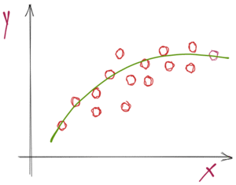
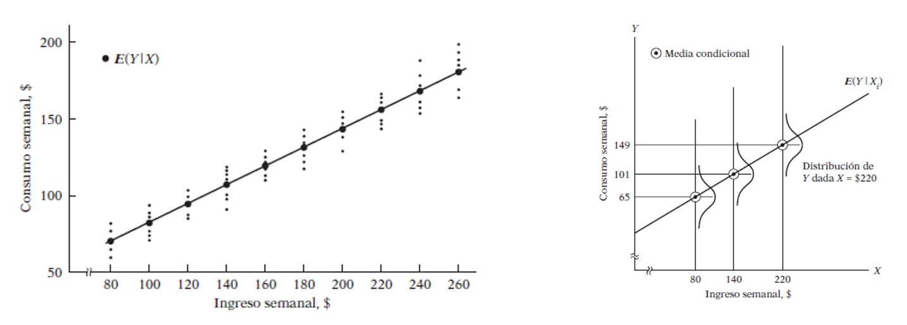
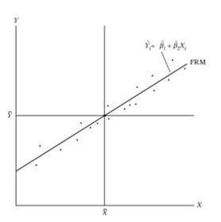
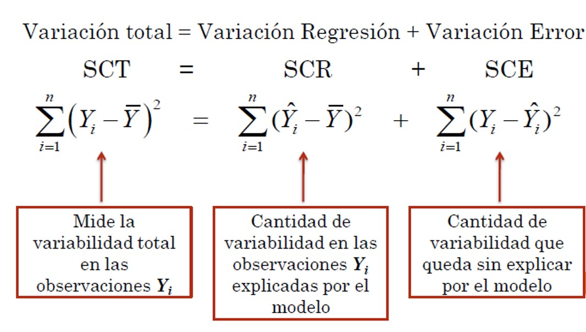
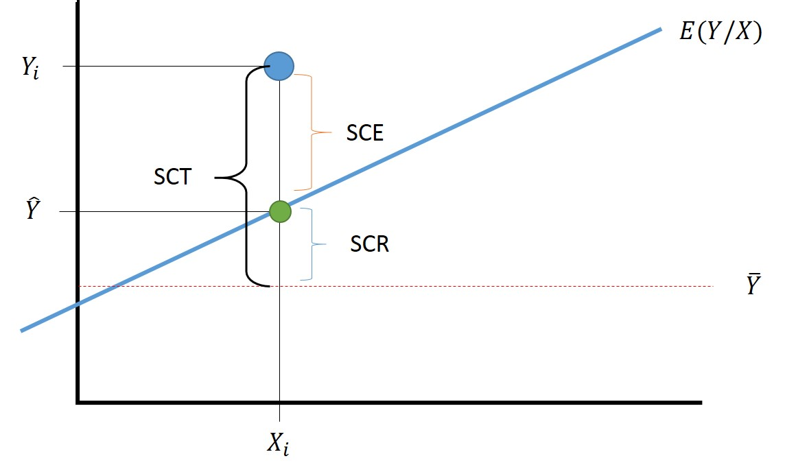

```{r setup, include = FALSE}
library(knitr)                              # paquete que trae funciones utiles para R Markdown
library(tidyverse)                          # paquete que trae varios paquetes comunes en el tidyverse
library(datos)                              # paquete que viene con datos populares traducidos al español :)
library(shiny)
# opciones predeterminadas
knitr::opts_chunk$set(echo = FALSE,         # FALSE: los bloques de código NO se muestran
                      dpi = 300,            # asegura gráficos de alta resolución
                      warning = FALSE,      # los mensajes de advertencia NO se muestran
                      error = FALSE)        # los mensajes de error NO se muestran


options(htmltools.dir.version = FALSE)

library(xaringan)

```

class: inverse, left, bottom
background-image: url("img/fondo.jpg")
background-size: cover


# **`r rmarkdown::metadata$title`**
----

## **`r rmarkdown::metadata$subtitle`**

### `r rmarkdown::metadata$author`
### `r rmarkdown::metadata$date`

```{r xaringanExtra-share-again, echo=FALSE}
xaringanExtra::use_share_again()
```

```{r xaringanExtra-clipboard, echo=FALSE}
xaringanExtra::use_clipboard()
```

---
name: hola
class: inverse, middle, center


# Pontificia Universidad Javeriana de Cali

--

## Programa de Economía
---


.pull-left[

<br><br><br><br><br>

```{r echo=FALSE, out.width = "110%" }

```
]

<br><br><br><br><br>


.pull-right[
# Orlando Joaqui-Barandica
### [www.joaquibarandica.com](https://www.joaquibarandica.com)
 *PhD.(C) in Industrial Engineering* 
 
 *MSc. Applied Economics*
 
 *BSc. Statistics*
]

---

name: menu
background-image: url("img/back2.jpg")
background-size: cover
class: left, middle, inverse

# Contenido

----


.pull-left[

### `r icon("dice-d6")` [Causalidad](#Causalidad)

### `r icon("database")` [Tipos de datos](#TipoDatos)

### `r icon("dice-d6")` [Análisis de regresión lineal](#LinealSimple)

### `r icon("sort-numeric-up")` [MCO](#MCO)

]


.pull-right[


### `r icon("upload")` [Propiedades algebraicas de los estimadores](#propiedades)

### `r icon("broom")` [Supuestos modelo clásico de regresión lineal](#supuestos)


### `r icon("sort-numeric-up")` [Coef. de determinación](#determinacion)

### `r icon("upload")` [Fuentes de variación](#variacion)


]

---


name: Causalidad
class: inverse, center, middle

# `r icon("dice-d6")`
# Causalidad
----

.right[
.bottom[
####  [`r icon("bell")`](#menu)
]
]

---

# Causalidad

.font120[.green[A pesar de que el análisis de regresión tiene que ver con la dependencia de una variable respecto de otras variables, esto no implica causalidad necesariamente.]]

<br>
.pull-left[

> .font120[`Una relación estadística, por más fuerte y sugerente que sea, nunca podrá establecer una conexión causal: nuestras ideas de causalidad deben provenir de estadísticas externas y, en último término, de una u otra teoría `]

]

.pull-right[
.center[

]


]

---

class: inverse, center, middle
background-image: url(https://media.giphy.com/media/VdKEHcPsjrlQv9Cv5n/giphy.gif)
background-size: cover


# Causalidad

<br>
<br>

## En un ejemplo de rendimiento del cultivo, no hay una razón estadística para suponer que la lluvia no depende del rendimiento del cultivo.


## Considerar que el rendimiento del cultivo depende de la lluvia (entre otras cosas) se debe a cuestiones no estadísticas: el sentido común indica que la relación no puede ser a la inversa, pues no es posible controlar la lluvia mediante el rendimiento del cultivo.

---


# Causalidad

> .font140[En la mayoría de las pruebas de teorías económicas, así como en la evaluación de políticas públicas, **el objetivo de los economistas** es inferir que una variable (por ejemplo, la educación) .orange[**tiene un efecto causal**] sobre otra variable (por ejemplo, la productividad de los trabajadores).]

<br> 
> .font140[Encontrar simplemente una relación entre dos o más variables puede ser sugestivo, pero no concluyente, a menos que pueda establecerse causalidad.]

<br>

> .font140[El concepto **ceteris paribus** —.orange[**"si todos los demás factores relevantes permanecen constantes"**]— tiene un papel importante en el análisis causal.]

---


# Causalidad


.font180[$$salario = f(educ, exper, capacitación)$$]

.font120[.orange[En este ejemplo, interesa conocer el efecto de una semana más de capacitación sobre el salario, cuando los demás componentes en particular Educ y Exper, permanecen constantes.]]

- .font130[Si se logran mantener constantes todos los demás factores relevantes...]
- .font130[... y se encuentra una relación entre **capacitación laboral** y **salarios**]

--

.center[
### Puede concluirse que tal capacitación tiene un efecto causal sobre la productividad de los trabajadores.
]

.font120[A pesar de que esto puede parecer bastante sencillo, aun ya en este nivel inicial debe ser claro que, .green[**salvo en casos muy especiales, no será posible mantener, literalmente, todo lo demás sin cambio.**]]


---

# Causalidad

.font120[La pregunta fundamental en la mayor parte de los estudios empíricos es: ]

<br>
.center[
## ¿se han mantenido constantes suficientes factores para que se justifique la causalidad?
]

<br>

- .font130[En la mayoría de los casos, las hipótesis en las ciencias sociales son de carácter ceteris paribus, es decir, para estudiar una relación entre dos variables todos los demás factores relevantes deben mantenerse constantes.]

- .font130[En las ciencias sociales, dado el carácter no experimental de la mayor parte de los datos que suelen recolectarse, hallar relaciones causales no es una tarea fácil.]


---

class: center, middle

# Datos experimentales $\neq$ Datos no experimentales

.font200[🚩🚩🚩]

---

name: TipoDatos
class: inverse, center, middle

# `r icon("database")`
# Tipos de datos
----

.right[
.bottom[
####  [`r icon("bell")`](#menu)
]
]

---


# Tipos de datos

.pull-left[
### Las bases de datos económicos pueden ser de diversos tipos. 

.font130[
>Aunque algunos métodos econométricos pueden ser empleados, con alguna o ninguna pequeña modificación, para distintos tipos de bases de datos, las características especiales de algunas bases de datos deben ser tomadas en cuenta y aprovecharse.]
]

.pull-right[
<br>
<br>
<br>
<br>
* ###Datos de corte transversal
* ###Datos de serie de tiempo
* ###Combinación de cortes transversales
]

---


name: LinealSimple
class: inverse, center, middle

# `r icon("database")`
# Análisis de regresión lineal
----

.right[
.bottom[
####  [`r icon("bell")`](#menu)
]
]


---

# Análisis de regresión lineal

<br>

El objetivo del análisis de regresión es el de construir una función que aproxime de la mejor manera el comportamiento de una variable aletoaria $(Y)$ a través del conocimiento previo del valor de una variable explicativa $(X)$, mediante una expresión lineal como la siguiente:

<br>

.font180[$$Y = \beta_0 + \beta_1X$$]

<br>

> - Y: es llamada la variable de respuesta o dependiente
> - X: es llamada la variable predictora o independiente
> - $\beta_0$: es el intercepto de la linea con el eje $Y$
> - $\beta_1$: es la pendiente de la linea de regresión


---

class: center

## Este modelo supone una **asociación lineal** entre las variables de estudio, por tanto antes de empezar, esta relación debe ser valorada


.pull-left[

```{r, warning=FALSE, echo=FALSE, message=FALSE, fig.height=5}


plot(iris$Petal.Length,iris$Petal.Width, main="Gráfico de dispersión")


# cor(iris$Petal.Length,iris$Petal.Width)


```


Correlación entre `Petal.Length` y `Petal.Width` 0.96


]


.pull-right[

```{r, warning=FALSE, echo=FALSE, message=FALSE, fig.height=6.5}

library(ggcorrplot)

ggcorrplot(cor(iris[,-5]))

```


]


---

# Análisis de regresión lineal

<br>

El análisis de regresión se relaciona en gran medida con la estimación o predicción de la .orange[**media (de la población) o valor promedio de la variable dependiente,**] con base en los valores conocidos o fijos de las variables explicativas.

<br>

> Las observaciones de la variable $Y$ (dependiente) se asumen aleatorias de una distribución con media $E(Y|X=x)$. 

> Las desviaciones de las observaciones $y_i$ de la $E(Y|X=x)$ se tienen en cuenta adicionando un error aleatorio $u_i$ al siguiente modelo:

.font180[$$y_i = \beta_0 + \beta_1 x_i + u_i$$]


---

# Ejemplo

Estos datos se refieren a la población total de 60 familias de una comunidad hipotética, así como a su ingreso semanal $(X)$ y su gasto de consumo semanal $(Y)$, en dólares. Las 60 familias se dividen en 10 grupos de ingresos (de 80 dólares a 260); asimismo, aparecen los gastos semanales de cada familia de los diversos grupos. Por consiguiente, hay 10 valores fijos de $X$ y los correspondientes valores $Y$ para cada valor $X$; así, hay 10 subpoblaciones $Y$.


.center[


]


---

# Ejemplo

> En total hay 10 valores medios para las 10 subpoblaciones de Y. A estos valores medios se les llama valores esperados condicionales: $E(Y|X)$.

<br>

.pull-left[

Es importante distinguir entre los valores esperados condicionales y el valor esperado incondicional: $E(Y)$.


$$E(Y|X) \neq E(Y)$$


Si sumamos los consumos semanales de las 60 familias que forman la población y dividimos este número entre 60, obtendremos la cantidad de 121.20 dólares (7272/60), que es el .orange[**valor de la media incondicional**], o esperada, del consumo semanal, $E(Y)$.

]

.pull-right[

.center[


]

]


---

<br><br>



### Esta figura muestra que para cada X (es decir, el nivel de ingresos) existe una población de valores Y (consumo semanal) que se distribuyen alrededor de la media (condicional) de dichos valores Y.


---


# ¿Qué se puede decir sobre la relación entre el consumo de una familia y un nivel determinado de ingresos?

<br>

Bajo el nivel de ingresos de $X_i$, el consumo de una familia en particular se agrupa alrededor del consumo promedio de todas las familias en ese nivel de $X_i$, es decir, alrededor de su esperanza condicional.

<br>

$$U = Y - E(Y|X)$$

o

$$Y = E(Y|X) + U$$

<br>

donde la desviación $U$ es una variable aleatoria no observable que adopta valores positivos o negativos. Técnicamente, $U$ se conoce como .orange[**perturbación estocástica o término de error estocástico**]


---


# De esta ecuación:

<br>

.font200[$$Y = E(Y|X) + U$$]


### Se puede decir que el gasto de una familia en particular, según su nivel de ingreso, se expresa como la suma de dos componentes:


<br>

> - $E(Y|X)$ : que es simplemente la media del consumo de todas las familias con el mismo nivel de ingreso. Este componente se conoce como componente sistemático, o determinista.


> - $U$ : que es el componente aleatorio, o no sistemático.


---

# Enfoque Estadistico: Descomposición ortogonal

Sea $Y$ una variable aleatoria con segundo momento finito, es decir, $E(|Y|^2) < \infty$, y un conjunto de información D; entonces siempre podemos encontrar una descomposición de $Y$ como la siguiente:


.font180[$$Y = E(Y|D) + U$$]


dónde el conjunto de información es $D : (X = x)$; por tanto $Y = E(Y|X) + U$ 

<br>

dónde $E(Y | X)$ es una función arbitraria.


---

# Enfoque Estadistico: Descomposición ortogonal


<br>

- $E(Y|X)$: Componente Sistemático
- $U$: Componente no sistemático

La existencia de dicha descomposición está garantizada siempre que $E(|Y|^2) < \infty$

<br>

### Ambos componentes de $Y$ deben satisfacer las siguientes propiedades:

- $E(U|X) = 0$
- $E(U^2|X) = Var(Y|X)< \infty$
- $E(U.E[Y|X])=0$


---


# Enfoque Estadístico: Descomposición ortogonal


Con información de $X$ podemos descomponer la variable $Y$ en dos partes, pero no hay una .orange[**teoría económica**] detrás; por tanto no dice si hay relaciones de `causalidad` entre las variables.

<br>

.pull-left[

- Las variables X generaran parcialmente a Y.

- Y causa (o genera) las variables X.

- o bien, que hay alguna otra causa común (y quizá desconocida) que genera conjuntamente tanto a Y como a X.

]

.pull-right[


]

---

# Enfoque Económico: Relación "causal"


Se desea que la descomposición estadística sea reflejo de las relaciones teóricas entre $X$ y $Y$.


### Ejemplo

**Y** (por ejemplo el .orange[**consumo**]) está generado por una función de las variables **X** (por ejemplo una función de la .orange[**renta**]) junto a otras causas distintas de la renta (**U**).


$$Y_n = h(X) + U_n$$
$$Y_n = h(1, X_1, X_2, ..., X_k) + U_n$$

* **Y**: .orange[**Variable Endógena.**] Se determina su valor o características a través del modelo 

* **X**: .orange[**Variables Exógenas o de control**]. Vienen dadas de manera externa al modelo, se tiene la capacidad de "alterar" su valor para, a través del modelo, controlar $Y$.

* **U**: .orange[**Perturbación.**] Efecto conjunto de otras variables o circunstancias que influyen en $Y$ y no observamos.


---


name: MCO
class: inverse, center, middle

# `r icon("database")`
# Mínimos cuadrados ordinarios
----

.right[
.bottom[
####  [`r icon("bell")`](#menu)
]
]

---


# Modelo de regresión lineal

<br>
<br>

Modelo especial en el que la descomposición ortogonal

<br>


.font200[$$Y = E(Y|X) + U$$]

<br>


> Es tal que $E(Y|X)$ es una función lineal de $x_n$

> $Var(Y|X)$ es constante.


---

# Modelo de regresión lineal

<br>

.pull-left[

> .font140[Hay .orange[tres supuestos generales] de un modelo econométrico que garantizan la existencia de una descomposición ortogonal como la del modelo clásico de regresión lineal.]

]

.pull-right[

.center[

## - Linealidad

## - Exogeneidad estricta

## - Perturbaciones esféricas

]

]

---


# MCO


.font140[En el análisis de regresión lineal el objetivo es utilizar los datos para trazar una línea que represente mejor la relación entre dos variables.]

.pull-left[

.center[

### Ya que se puede trazar más de una recta que razonablemente se ajuste a la distribución de los datos, es preferible utilizar el método de los **mínimos cuadrados** que resulta en una sola y mejor línea de regresión *.orange[(Recta del mejor ajuste)]*.
]
]

.pull-right[
<br>
.center[

]
]

> **Mínimos Cuadrados Ordinarios (MCO):** El objetivo de este procedimiento es estimar los parámetros tal que la suma de cuadrados (SC) de las diferencias entre las observaciones (valores reales) y la línea recta estimada sea mínima (Min SCError).


---

# MCO

Si lo que interesa es minimizar la suma de cuadrados del error...


.center[
### ¿Qué es el error?
]

--

.font1800[$$\hat{e}_i = y_i - \hat{y}_i$$]

### Entonces, interesa...


.pull-left[
.center[

]
]

.pull-right[

<br>
$$SCE = \sum_{i=1}^n (y_i - \hat{y}_i)^2$$
]

---

# MCO

### Minimizar SCE:

$$SCE = \sum_{i=1}^n (y_i - \hat{y}_i)^2 = \sum_{i=1}^n (y_i - (\hat{\beta_0} + \hat{\beta_1}x_i))^2$$


$$Min SCE =  \frac{\partial SCE}{\partial \hat{\beta_j}}$$

--

### Ecuaciones normales:


$$\sum_{i=1}^n y_i = n \hat{\beta_0} + \hat{\beta_1} \sum_{i=1}^n x_i$$
$$\sum_{i=1}^n x_i y_i = \beta_0 \sum_{i=1}^n x_i + \hat{\beta_1} \sum_{i=1}^n x_i^2$$

---

# MCO

### Tarea: Demostrar. 

.font140[.orange[A partir de las ecuaciones normales llegar a:]]

<br>

$$\hat{\beta_0} = \bar{y} - \hat{\beta_1}\bar{x}$$

<br>
<br>


$$\begin{align}
\hat{\beta_1} & = & \frac{\sum_{i=1}^n x_i y_i - n \bar{x}\bar{y}}{\sum_{i=1}^n x_i^2 - n\bar{x}^2}   \nonumber \\
 & = & r \left( \frac{S_y}{S_x}\right)  \nonumber \\
 & = & \frac{cov(x,y)}{V(x)}
\end{align}$$


---

#MCO 

.font150[Una vez que se han determinado las estimaciones por MCO del intercepto y de la pendiente, se obtiene la línea de regresión de MCO.]

<br>

$$E(Y/X) = \hat{\beta_0} + \hat{\beta_1}{X}$$

$$\hat{Y} = \hat{\beta_0} + \hat{\beta_1}{X}$$

<br>
<br>

> - **El intercepto,** $\hat{\beta_0}$ es el valor predicho de Y cuando $X = 0$, aunque en algunos casos no tiene sentido hacer $X = 0$.

> - **La pendiente,** $\hat{\beta_1}$ es de primordial interés, pues indica la cantidad en la que cambia $\hat{Y}$ cuando X se incrementa en una unidad.


---

name: propiedades
class: inverse, center, middle

# `r icon("database")`
# Propiedades algebraicas de los estimadores
----

.right[
.bottom[
####  [`r icon("bell")`](#menu)
]
]

---


# MCO 

### Propiedades algebraicas de los estimadores


Las estimaciones de MCO y sus correspondientes estadísticos tienen varias propiedades útiles.

<br>

> 1️⃣ La suma, y por tanto el promedio muestral de los residuales de MCO, es cero. Matemáticamente,


$$\sum \hat{u} = 0$$


> 2️⃣ La covarianza muestral de los regresores y los residuales de MCO es cero.

$$Cov(x,u) = 0$$


### Demostrar lo anterior. 

.orange[Recuerde la fórmula de la covarianza:] $cov(x,y) = E[(x - E(x))(y - E(y))]$


---


# MCO

### Propiedades algebraicas de los estimadores

$$\begin{align}
cov(u,x) &=& E[(u - E(u))(x - E(x))] \nonumber \\
&=& E[u (x - E(x)] \nonumber  \\
&=& E[ux - uE(x)] \nonumber  \\
&=& E(ux) - E(u)E(x) \nonumber \\
&=& 0 - 0E(x) \nonumber \\
&=& 0 \nonumber
\end{align}$$

o

$$\begin{align}
cov(u,x) &=& E(ux) - E(u)E(x) \nonumber \\
0 &=& E(ux) - 0E(x) \nonumber \\
cov(u,x) &=& E(ux) = 0 \nonumber
\end{align}$$


---

# MCO

### Propiedades algebraicas de los estimadores


> 3️⃣ El punto $(\bar{x},\bar{y})$ se encuentra siempre sobre la línea de regresión de MCO.

$$\hat{Y} = \hat{\beta_0} + \hat{\beta_1}{X}$$

$$\bar{Y} = \hat{\beta_0} + \hat{\beta_1}\bar{X}$$

.center[

]

---

name: supuestos
class: inverse, center, middle

# `r icon("database")`
# Supuestos modelo clásico de regresión lineal
----

.right[
.bottom[
####  [`r icon("bell")`](#menu)
]
]

---

# MCO

### Supuestos modelo clásico de regresión lineal


El objetivo es no sólo obtener $\hat{\beta_0}$ y $\hat{\beta_1}$ sino también inferir los verdaderos ${\beta_0}$ y ${\beta_1}$; por ejemplo, si quisiéramos saber cuán cerca está $\hat{Y}$ de la verdadera $E(Y/X)$.


<br>

> 👉️ **Supuesto 1.** .orange[Modelo de regresión lineal]

<br>

El modelo de regresión es lineal en los parámetros, aunque puede o no ser lineal en las variables.

### Ejemplo:

$$Y = \beta_0 + \beta_1{X} + u$$
$$Y = \beta_0 + \beta_1{X^2} + u$$

---

# MCO

### Supuestos modelo clásico de regresión lineal

<br>

> 👉️ **Supuesto 2.** .orange[Valores fijos de X, o valores de X independientes del término de error:]

<br>


Los valores que toma la regresora $X$ pueden considerarse fijos en muestras repetidas (el caso de la regresora fija), o haber sido muestreados junto con la variable dependiente $Y$ (el caso de la regresora estocástica).

<br>

En el segundo caso se supone que la(s) variable(s) $X$ y el término de error son independientes.

<br>

.font160[$$cov(x,u) = 0$$]


---


# MCO

### Supuestos modelo clásico de regresión lineal

<br>

> 👉️ **Supuesto 2.** .orange[Valores fijos de X, o valores de X independientes del término de error:]

<br>


## .green[De tal manera...]

* $X_i$ es **endógeno** si...

.font150[$$cov(u,x) \neq 0$$]

* $X_i$ es **exógeno** si...

.font150[$$cov(u,x) = 0$$]

---

class: center, middle

# Si se garantiza la exogeneidad estricta los estimadores son insesgados y consistentes

---

# MCO

### Supuestos modelo clásico de regresión lineal

<br>

> 👉️ **Supuesto 3.** .orange[El valor medio de la perturbación ui es igual a cero]

<br>

Dado el valor de $X_i$, la media o el valor esperado del término de perturbación aleatoria $u_i$ es cero.

<br>

$$E(u/x) = 0$$


si, $X$ no es estocástica (aleatoria),

<br>
$$E(u) = 0$$


---

# MCO

### Supuestos modelo clásico de regresión lineal

<br>

> 👉️ **Supuesto 3.** .orange[El valor medio de la perturbación ui es igual a cero]

<br>

**Es importante señalar:**

- El supuesto 3 implica que no hay sesgo de especificación o error de especificación en el modelo del análisis empírico.

- También observe que si la media condicional de una variable aleatoria, dada otra variable aleatoria, es cero, la covarianza entre las dos variables es cero y, por tanto, las dos variables no están correlacionadas. 

.center[
### **X y u no están correlacionadas. --> .orange[Exogeneidad estricta]**
]


---

# MCO

### Supuestos modelo clásico de regresión lineal

<br>

> 👉️ **Supuesto 4.** .orange[Homoscedasticidad o varianza constante de u]


La varianza del término de error, o de perturbación, es la misma sin importar el valor de $X$. Simbólicamente, tenemos que

$$\begin{align}
var(u/x) &=& E[u - E(u/x)]^2 \nonumber \\
&=& E[(u-E(u/x))(u-E(u/x))] \nonumber  \\
&=& E[u^2] - 2E(u)E(u/x) + (E(u/x))^2 \\
&=& E[u^2] - 2 (0)(0) + (0)^2 \\ 
&=& E[u^2] \\
&=& E[(y -\hat{y})^2] \\
&=& \sigma^2 \nonumber
\end{align}$$

Por el supuesto 3, $E(u|x) = 0$ es la esperanza del error condicionado a $x$. 


---

# MCO

### Supuestos modelo clásico de regresión lineal

<br>

> 👉️ **Supuesto 5.** .orange[No hay autocorrelación entre las perturbaciones]


<br>

Dados dos valores cualesquiera de $X$, $X_i$ y $X_j$ $(i \neq j )$, la correlación entre dos $u_i$ y $u_j$ cualesquiera $(i \neq j )$ es cero. 

<br> 

En pocas palabras, estas observaciones se muestrean de manera independiente.

<br>

$$cov(u_i u_j / X_i X_j) = 0$$

---

# MCO

### Supuestos modelo clásico de regresión lineal

<br>

> 👉️ **Supuesto 6.**  .orange[El número de observaciones **n** debe ser mayor que el número de parámetros por estimar]

<br>

.center[
### Sucesivamente, el número de observaciones n debe ser mayor que el número de variables explicativas.
]


---

# MCO

### Supuestos modelo clásico de regresión lineal

<br>

> 👉️ **Supuesto 7.**   .orange[La naturaleza de las variables X]

<br>

No todos los valores $X$ en una muestra determinada deben ser iguales. Técnicamente, $var(X)$ debe ser un número positivo. 

Además, no puede haber valores atípicos de la variable $X$, es decir, valores muy grandes en relación con el resto de las observaciones.


---


# Teorema de Gauss-Markov


### Un estimador $\hat{\beta_1}$ es el mejor estimador lineal insesgado (MELI) de $\beta_1$ si cumple lo siguiente:

<br>


.pull-left[

----

> - Es lineal, es decir, función lineal de una variable aleatoria, como la variable dependiente Y en el modelo de regresión.


> - Es insesgado, es decir, su valor promedio o esperado, $E(\hat{\beta_1})$, es igual al valor verdadero, ${\beta_1}$


> - Tiene varianza mínima dentro de la clase de todos los estimadores lineales insesgados; un estimador insesgado con varianza mínima se conoce como estimador eficiente.


----

]


.pull-right[

.center[
### Gauss-Markov


]
]

---

name: determinacion
class: inverse, center, middle

# `r icon("database")`
# Coeficiente de determinación
----

.right[
.bottom[
####  [`r icon("bell")`](#menu)
]
]

---


# Coeficiente de determinación


Coeficiente de determinación $r^2$: Proporción de la variabilidad de $Y$ que es posible explicar a través del modelo planteado, es decir, por la variación de la variable dependiente $X$:

<br>

$$R^2 = r^2 \quad , \quad 0\leq R^2 \leq 1$$
<br>

> - Su cálculo es fácil, es el coeficiente de correlación al cuadrado.
> - Para interpretar mejor el coeficiente de determinación se debe convertir a porcentaje.


<br>

### ¿Con cuánta exactitud predice la ecuación de regresión a la variable $Y$ mediante la variable $X$?

> Si fuera posible hacer predicciones **perfectas** entonces $R^2 = 100\%$, esto significa que la variable independiente explica o representa toda la variación de la variable dependiente

---

name: variacion
class: inverse, center, middle

# `r icon("database")`
# Fuentes de variación
----

.right[
.bottom[
####  [`r icon("bell")`](#menu)
]
]

---


# Fuentes de variación

A medida que aumenta la fuerza de la relación lineal entre dos variables, aumenta el coeficiente de correlación y disminuye el error estándar de estimación, lo que indica que $S_{y.x}$ y $r$ están inversamente relacionados.

<br>

.pull-left[

#### .orange[La variación total se divide en dos componentes:]


----

#### 1. (SCR) El que se deriva de la regresión (a su vez, explicado por la variable independiente)

----

#### 2. (SCE) El error o residual, que es la variación inexplicable

----

]

.pull-right[



]

---

# Fuentes de variación

.center[

]

.pull-left[
Recuerde que el coeficiente de determinación se define como el porcentaje de la variación total (SCT) explicado por la ecuación de regresión (SCR)... 

Entonces en términos de la varición total como puede escribirse el $R^2$ ?


$$R^2 =  \frac{SCR}{SCT} =  1 - \frac{SCE}{SCT}$$

]

.pull-right[

.orange[**Algunas fórmulas útiles:**]

- $SCT = S_{yy} = V(Y)$
- $SCR = r^2 SCT$
- $SCE = SCT - SCR$
- $R^2 = \frac{SCR}{SCT} = \frac{(S_{xy})^2}{S_{xx}S_{yy}}$

]

---


class: inverse, center, middle
background-color: #122140

.pull-left[

.center[
<br><br>

# Gracias!!!

<br>


### ¿Preguntas?

<br>


```{r qr, echo=FALSE, fig.align="center", out.width="49%"}
knitr::include_graphics("img/qr-code.png")
```


]


]


.pull-right[

<br> 
<br> 


### [www.joaquibarandica.com](https://www.joaquibarandica.com)

`r icon("envelope")` orlando.joaqui@javerianacali.edu.co


]


<br><br><br>


