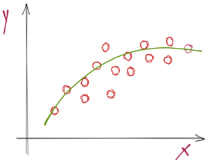

```{r setup, include = FALSE}
library(knitr)                              # paquete que trae funciones utiles para R Markdown
library(tidyverse)                          # paquete que trae varios paquetes comunes en el tidyverse
library(datos)                              # paquete que viene con datos populares traducidos al español :)
library(shiny)
# opciones predeterminadas
knitr::opts_chunk$set(echo = FALSE,         # FALSE: los bloques de código NO se muestran
                      dpi = 300,            # asegura gráficos de alta resolución
                      warning = FALSE,      # los mensajes de advertencia NO se muestran
                      error = FALSE)        # los mensajes de error NO se muestran


options(htmltools.dir.version = FALSE)

library(xaringan)

```

class: inverse, left, bottom
background-image: url("img/fondo.jpg")
background-size: cover


# **`r rmarkdown::metadata$title`**
----

## **`r rmarkdown::metadata$subtitle`**

### `r rmarkdown::metadata$author`
### `r rmarkdown::metadata$date`

```{r xaringanExtra-share-again, echo=FALSE}
xaringanExtra::use_share_again()
```

```{r xaringanExtra-clipboard, echo=FALSE}
xaringanExtra::use_clipboard()
```

---
name: hola
class: inverse, middle, center


# Pontificia Universidad Javeriana de Cali

--

## Programa de Economía
---


.pull-left[

<br><br><br><br><br>

```{r echo=FALSE, out.width = "110%" }

```
]

<br><br><br><br><br>


.pull-right[
# Orlando Joaqui-Barandica
### [www.joaquibarandica.com](https://www.joaquibarandica.com)
 *PhD.(C) in Industrial Engineering* 
 
 *MSc. Applied Economics*
 
 *BSc. Statistics*
]

---

name: menu
background-image: url("img/back2.jpg")
background-size: cover
class: left, middle, inverse

# Contenido

----


.pull-left[

### `r icon("dice-d6")` [Estimación por intervalos](#intervalos)

### `r icon("database")` [Pruebas de Hipótesis](#hipotesis)

### `r icon("dice-d6")` [ANOVA](#anova)

]


.pull-right[


### `r icon("upload")` [Predicción](#prediccion)

### `r icon("sort-numeric-up")` [Normalidad](#normalidad)

### `r icon("broom")` [Regresión a través del origen](#origen)


]

---


name: intervalos
class: inverse, center, middle

# `r icon("dice-d6")`
# Estimación por intervalos
----

.right[
.bottom[
####  [`r icon("bell")`](#menu)
]
]


---


# Estimación por Intervalos: Algunas Ideas Básicas


Si se cumplen los supuestos del modelo de regresión lineal, entonces la distribución del estimador de MCO es normal y se puede utilizar para construir intervalos de confianza y hacer pruebas de hipótesis.

<br>
<br>

----

.center[

### Intervalos de Confianza para los Coeficientes

Un intervalo de confianza para un coeficiente $\beta_j$ es un rango de valores dentro del cual se espera que esté el verdadero valor del coeficiente con una cierta probabilidad.

]


----

---


# Intervalos de confianza para los coeficientes de regresión $\beta_0$ y $\beta_1$


.pull-left[

Un intervalo de confianza del $(1-\alpha)100%$ para el coeficiente de regresión $\beta_1$ está dado por:

$$\hat{\beta}_1 \pm t_{\alpha/2, n-2} \frac{\hat{\sigma}}{\sqrt{\sum_{i=1}^{n}(x_{i1}-\bar{x}_1)^2}}$$

El intervalo de confianza para el coeficiente de regresión $\beta_0$ es:

$$\hat{\beta}_0\pm t_{\alpha/2,n-2}\hat{\sigma}\sqrt{\frac{1}{n}+\frac{\bar{x}^2}{\sum_{i=1}^{n}(x_i-\bar{x})^2}}$$

]

.pull-right[

En ambos casos, $t_{\alpha/2,n-2}$ es el valor crítico de la distribución $t$ de Student con $n-2$ grados de libertad y un nivel de significancia $\alpha$.

La estimación del error estándar $\hat{\sigma}$ se calcula como:

$$\hat{\sigma}=\sqrt{CME}=\sqrt{\frac{\sum_{i=1}^{n}(y_i-\hat{y}_i)^2}{n-2}}$$

El intervalo de confianza nos indica que con un nivel de confianza de $1-\alpha$, el verdadero valor del coeficiente de regresión está contenido en el intervalo de confianza calculado.

]

.orange[**Nota:** Recuerda que] $t_{\alpha/2, n-2}$ .orange[es el valor crítico de la distribución] $t$ .orange[de Student con] $n-2$ .orange[grados de libertad, que deja una probabilidad de] $\alpha/2$ .orange[en la cola superior y] $\alpha/2$ .orange[en la cola inferior.]


---

# En R...

.pull-left[


Siendo `residuos` el objeto que guarde los residuos del modelo estimado

```{c1, warning=FALSE, message=FALSE, eval=FALSE, echo=TRUE}


# Cálculo de s (estimación de la desviación estándar del error)
s <- sqrt(sum(residuos^2) / (n - 2))

# Cálculo de la matriz de varianzas y covarianzas de los coeficientes
X <- model.matrix(modelo)
V <- s^2 * solve(t(X) %*% X)

# Cálculo de los errores estándar de los coeficientes
se_beta_0 <- sqrt(V[1, 1])
se_beta_1 <- sqrt(V[2, 2])

```

]

.pull-right[

En particular, vamos a ajustar un modelo de regresión lineal simple utilizando la variable horsepower (caballos de fuerza) como predictor de la variable mpg (millas por galón).

```{c1, warning=FALSE, message=FALSE, eval=FALSE, echo=TRUE}

data(mtcars)
  
model <- lm(mpg ~ horsepower, data = mtcars)
  
confint(model)

  
# Esta es la salida

                   2.5 %      97.5 %
(Intercept) 28.90595959 39.18122022
horsepower  -0.15243840 -0.07949478
```

]


---

class: middle, center


# ¿Distribución t-student o normal?


---

# ¿Distribución t-student o normal?

La razón por la que se utiliza la distribución t en lugar de la distribución normal se debe a que la distribución t tiene colas más anchas que la distribución normal, lo que implica que para muestras pequeñas o cuando la varianza del error es desconocida, el intervalo de confianza basado en la distribución t es más amplio que el intervalo basado en la distribución normal. Esto se hace para tener una mayor probabilidad de incluir el verdadero valor del parámetro desconocido, lo que es especialmente importante en muestras pequeñas.

<br>

----
> .green[Cuando el tamaño de la muestra es grande y la varianza del error es conocida, la distribución t y la distribución normal son muy similares y la diferencia en la amplitud del intervalo de confianza basado en ambas distribuciones es despreciable. Por lo tanto, en ese caso se puede utilizar la distribución normal.]

----


.center[
## Pero... y entonces?
]

---

# ¿Distribución t-student o normal?

Es cierto que cuando se estima una regresión lineal en R, se calculan los valores t de los estimadores de los coeficientes de la regresión, incluso cuando el tamaño de la muestra es grande. Esto se debe a que, en general, es preferible utilizar la distribución t para realizar pruebas de hipótesis y construir intervalos de confianza, ya que esta distribución tiene en cuenta la incertidumbre adicional que se presenta al estimar la desviación estándar del error de la regresión a partir de los datos.


<br>


.pull-left[

.orange[Además, aunque la diferencia en la amplitud del intervalo de confianza entre la distribución t y la distribución normal puede ser despreciable para muestras grandes, la distribución t se utiliza comúnmente para mantener la consistencia en el enfoque estadístico, es decir, utilizar la misma distribución en todos los casos, independientemente del tamaño de la muestra o la estimación de la desviación estándar del error.]
]

.pull-right[


]

---


class: middle, center

# En resumen...

<br>

En resumen, aunque en la práctica el uso de la distribución t puede no tener un gran impacto en los resultados cuando la muestra es grande, es una práctica común en estadística y econometría para mantener la consistencia en la aplicación de los métodos estadísticos.


---


# Intervalo de Confianza para $\sigma^2$

Consideramos el modelo simple de regresión:

$$y_i = \beta_0 + \beta_1 x_i + u_i$$

donde $u_i \sim N(0, \sigma^2)$

Para construir un intervalo de confianza para $\sigma^2$ utilizamos la distribución $\chi^2$:

$$\frac{(n-2)\hat{\sigma}^2}{\sigma^2} \sim \chi^2_{n-2}$$

donde $\hat{\sigma}^2$ es la varianza muestral de los residuos y $n$ es el tamaño de la muestra.

Entonces un intervalo de confianza para $\sigma^2$ es:

$$\left(\frac{(n-2)\hat{\sigma}^2}{\chi^2_{\alpha/2, n-2}}, \frac{(n-2)\hat{\sigma}^2}{\chi^2_{1-\alpha/2, n-2}}\right)$$

donde $\chi^2_{\alpha/2, n-2}$ y $\chi^2_{1-\alpha/2, n-2}$ son los cuantiles de la distribución $\chi^2$ con $n-2$ grados de libertad en los que el área bajo la curva a la izquierda de los cuantiles es $\alpha/2$ y $1-\alpha/2$ respectivamente.

---

# En R...

.pull-left[

.scroll-box-20[

```{r, warning=FALSE, message=FALSE, eval=FALSE, echo=TRUE}

# Cargar los datos de ejemplo
data(mtcars)

# Ajustar el modelo
modelo_simple <- lm(mpg ~ wt, data = mtcars)

# Obtener los residuos
residuos <- modelo_simple$residuals

# Tamaño de la muestra
n <- length(residuos)

# Varianza muestral de los residuos
s2 <- sum(residuos^2) / (n-2)

# Cuantiles de la distribución chi-cuadrado
alpha <- 0.05
c1 <- qchisq(alpha/2, n-2)
c2 <- qchisq(1-alpha/2, n-2)

# Intervalo de confianza para la varianza del error
intervalo <- (n-2) * s2 / c(c2, c1)
names(intervalo) <- c("inferior", "superior")
intervalo

```


]
]

.pull-right[

```{r, warning=FALSE, message=FALSE, eval=TRUE}

# Cargar los datos de ejemplo
data(mtcars)

# Ajustar el modelo
modelo_simple <- lm(mpg ~ wt, data = mtcars)

# Obtener los residuos
residuos <- modelo_simple$residuals

# Tamaño de la muestra
n <- length(residuos)

# Varianza muestral de los residuos
s2 <- sum(residuos^2) / (n-2)

# Cuantiles de la distribución chi-cuadrado
alpha <- 0.05
c1 <- qchisq(alpha/2, n-2)
c2 <- qchisq(1-alpha/2, n-2)

# Intervalo de confianza para la varianza del error
intervalo <- (n-2) * s2 / c(c2, c1)
names(intervalo) <- c("inferior", "superior")
intervalo

```

]


---


name: hipotesis
class: inverse, center, middle

# `r icon("dice-d6")`
# Pruebas de Hipótesis
----

.right[
.bottom[
####  [`r icon("bell")`](#menu)
]
]


---


# Pruebas de hipótesis: método del intervalo de confianza


* Hasta ahora, hemos estimado los coeficientes del modelo y hemos construido intervalos de confianza para ellos.

* Pero a veces, queremos hacer una afirmación más específica sobre el valor de un coeficiente en particular.

* Es aquí donde entran las pruebas de hipótesis.

## Hipótesis nula y alternativa

Las pruebas de hipótesis implican dos hipótesis:

> * Hipótesis nula. $H_0$: afirmación sobre el valor de un parámetro poblacional
> * Hipótesis alternativa. $H_1$: afirmación que contradice $H_0$

.orange[**Ejemplo:**]

$H_0$: $\beta_1 = 0$ (no hay relación entre X e Y) 

$H_1$: $\beta_1 \neq 0$ (hay una relación entre X e Y)

---

## Estadístico de prueba

Un estadístico de prueba es una función de los datos de la muestra que se utiliza para probar la hipótesis nula.

En el modelo lineal simple, el estadístico de prueba para probar la hipótesis nula:


$H_0: \beta_1 = \beta_{HipNula}$ es: 


$$t = \frac{\hat{\beta}_1 - \beta_{HipNula}}{ee(\hat{\beta}_1)}$$

donde,

* $\hat{\beta}_1$ es el estimador de máxima verosimilitud de $\beta_1$

* $ee(\hat{\beta}_1)$ es el error estándar de $\hat{\beta}1$

* $\beta_{HipNula}$ es el valor especificado en la hipótesis nula

---

## Región crítica


Para tomar una decisión sobre si rechazar o no la hipótesis nula, necesitamos establecer una región crítica

----

> La región crítica es un conjunto de valores para el estadístico de prueba en el que rechazamos la hipótesis nula

----


.pull-left[

.orange[**En el caso de una prueba bilateral, la región crítica está dada por:**]

$$|t| > t_{n-2, \frac{\alpha}{2}}$$

donde $t_{n-2, \frac{\alpha}{2}}$ es el valor crítico de la distribución t de Student con $n-2$ grados de libertad y un nivel de significancia $\alpha/2$


]

.pull-right[

```{r, warning=FALSE, message=FALSE, eval=TRUE, fig.height=4}

# Generar datos
x <- seq(-4, 4, 0.01)
y <- dt(x, df = 10)

# Intervalo de confianza
conf_int <- qt(c(0.025, 0.975), df = 10)

# Crear gráfico en ggplot
ggplot(data.frame(x = x, y = y), aes(x = x, y = y)) + 
  geom_line(color = "blue", size = 1) +
  geom_vline(xintercept = conf_int[1], linetype = "dashed", color = "red", size = 1) +
  geom_vline(xintercept = conf_int[2], linetype = "dashed", color = "red", size = 1) +
  theme_bw()

```


]


---

.pull-left[

## Valor p

En lugar de establecer una región crítica, podemos utilizar el valor p para tomar una decisión.

El valor p es la probabilidad de obtener un valor del estadístico de prueba tan extremo o más extremo que el valor observado, asumiendo que la hipótesis nula es verdadera.

Si el valor p es menor que el nivel de significancia $\alpha$, rechazamos la hipótesis nula

## Regla $2t$

Si el número de grados de libertad es 20 o más, y si $\alpha$, el nivel de significancia, se fija en 0.05, se rechaza la hipótesis nula $\beta_1 = 0$ si el valor de $t = \hat{\beta_1}/ee(\hat{\beta_1})$ es superior a 2 en valor absoluto.

]

.pull-right[

## Resumen


.orange[La prueba del intervalo de confianza se realiza de la siguiente manera:]

Estimamos el intervalo de confianza al nivel de significancia $\alpha$ para $\beta_1$ usando la fórmula ya vista.

Si el intervalo de confianza no contiene el valor 0, entonces rechazamos la hipótesis nula y concluimos que hay evidencia estadística para afirmar que $\beta_1$ es diferente de cero al nivel de significancia $\alpha$. En caso contrario, no podemos rechazar la hipótesis nula.

----

El p-value para la prueba de hipótesis es el valor de la probabilidad acumulada en la cola correspondiente de la distribución t con $n-2$ grados de libertad, utilizando la estadística de prueba $t = \frac{\hat{\beta_1}}{ee(\hat{\beta_1})}$. Si la p-value es menor que el nivel de significancia $\alpha$, entonces rechazamos la hipótesis nula.


]

---

# En R...

Supongamos que tenemos un modelo de regresión lineal simple con una variable explicativa $x$ y una variable respuesta $y$. Queremos probar las siguientes hipótesis sobre los coeficientes de regresión:

<br>

> $H_0: \beta_1 = 0$ (la variable explicativa no tiene efecto sobre la variable respuesta)

> $H_1: \beta_1 \neq 0$ (la variable explicativa sí tiene efecto sobre la variable respuesta)

<br>

Podemos realizar la prueba de hipótesis utilizando la función `summary()` en R después de ajustar el modelo de regresión lineal simple. 

> La función `summary()` proporciona información sobre el modelo, incluyendo el valor del estadístico de prueba, el valor $p$ y el intervalo de confianza para los coeficientes de regresión.

---

# En R...

Por ejemplo, utilizando el conjunto de datos mtcars, podemos ajustar el siguiente modelo:


.pull-left[

`model <- lm(mpg ~ wt, data = mtcars)` 

`summary(model)`

.font70[
```{r, warning=FALSE, message=FALSE, eval=TRUE}

model <- lm(mpg ~ wt, data = mtcars)
summary(model)

```
]

]

.pull-right[

* En la tabla de coeficientes, podemos ver que el coeficiente estimado para wt es -5.3445 con un error estándar de 0.5591. 

* Podemos probar las hipótesis utilizando la prueba $t$ sobre el coeficiente de regresión para wt. La estadística de prueba es $t = \frac{-5.3445}{0.5591} = -9.559$ y el valor $p$ es 1.29e-10. 

* Dado que el valor $p$ es menor que cualquier nivel de significancia común, podemos rechazar la hipótesis nula y concluir que hay evidencia suficiente para afirmar que la variable wt tiene un efecto significativo en mpg.

]


---


name: anova
class: inverse, center, middle

# `r icon("dice-d6")`
# ANOVA
----

.right[
.bottom[
####  [`r icon("bell")`](#menu)
]
]


---


# Análisis de regresión y análisis de varianza

## Análisis de varianza (ANOVA)


> La suma de cuadrados de la regresión (SCR) se define como:

$$SCR = \sum_{i=1}^{n}(\hat{Y}_i - \bar{Y})^2$$

donde $\hat{Y}_i$ es el valor estimado de $Y_i$ y $\bar{Y}$ es la media de $Y$

> La suma de cuadrados del error (SCE) se define como:

$$SCE = \sum_{i=1}^{n}(Y_i - \hat{Y}_i)^2$$

> La suma de cuadrados total (SCT) se define como:

$$SCT = \sum_{i=1}^{n}(Y_i - \bar{Y})^2$$

Se cumple que SCT = SCR + SCE

---

# Análisis de regresión y análisis de varianza

## Grados de libertad


* Los grados de libertad de SCR son $1$

* Los grados de libertad de SCE son $n-2$
 
* Los grados de libertad de SCT son $n-1$
 
* La media cuadrática de SCR (CMR) se define como $SCR/1$
 
* La media cuadrática del error (CME) se define como $SCE/(n-2)$


---

# Análisis de regresión y análisis de varianza

## Grados de libertad


En la tabla ANOVA para un modelo de regresión lineal simple, los grados de libertad se dividen en dos componentes: los grados de libertad del modelo y los grados de libertad del error.

> Los grados de libertad del modelo, a menudo denotados como $df_{modelo}$, son iguales al número de variables predictoras en el modelo más una constante (si se incluye). Para un modelo de regresión lineal simple, solo hay una variable predictora, por lo que $df_{modelo} = 1$.

----

> Los grados de libertad del error, a menudo denotados como $df_{error}$, son iguales al número total de observaciones menos el número de parámetros estimados. Para un modelo de regresión lineal simple, hay dos parámetros que se estiman: la intersección y la pendiente. Entonces, $df_{error} = n - 2$, donde $n$ es el número total de observaciones.

----

> Los grados de libertad totales, a menudo denotados como $df_{total}$, son iguales al número total de observaciones menos uno. Entonces, $df_{total} = n - 1$.

---

# Análisis de regresión y análisis de varianza

## Tabla Anova

|Fuente de variación|Suma de cuadrados (SC)|Grados de libertad (df)|Cuadrados medios (CM)|F estadístico|
|------------------|----------------------|------------------------|------------------------|-------------------|
|Modelo             |SCR                   | $$df_{modelo}$$         | $$CMR = SCR/df_{modelo}$$ | $$F = CMR/CME$$ |
|Error              |SCE                   | $$df_{error}$$          | $$CME = SCE/df_{error}$$  |                   |
|Total              |SCT                   | $$df_{total}$$          |                           |                   |

---

# Análisis de regresión y análisis de varianza

## Estadístico F


El estadístico F se define como CMR/CME

<br>

> Bajo la hipótesis nula H0: $\beta_1 = 0$, F sigue una distribución F con 1 y n-2 grados de libertad


> Si F es mayor al valor crítico de la distribución F, se rechaza H0

<br>

El estadístico F para la prueba de hipótesis H0: $\beta_1 = 0$ es el mismo que el estadístico t.

.orange[Sin embargo, la prueba F tiene una interpretación más general y puede utilizarse para comparar modelos.*

---

# En R...


```{r, warning=FALSE, message=FALSE, eval=TRUE, echo=TRUE}

# Cargando la base de datos
data(mtcars)

# Ajustando el modelo lineal simple
modelo <- lm(mpg ~ hp, data = mtcars)

# Tabla ANOVA
anova(modelo)

```

---


name: prediccion
class: inverse, center, middle

# `r icon("dice-d6")`
# Predicción
----

.right[
.bottom[
####  [`r icon("bell")`](#menu)
]
]


---


# Predicción

.pull-left[


* En muchas situaciones, nos interesa predecir el valor de una variable dependiente $Y$ para un conjunto de valores dados de las variables explicativas $X_1, X_2, ..., X_k$.

* Por ejemplo, podemos querer predecir la demanda de un producto en función de su precio y otros factores relacionados.

* El análisis de regresión nos permite modelar la relación entre las variables explicativas y la variable dependiente, y usar ese modelo para hacer predicciones.

]


.pull-right[


]

---

# Predicción

Una vez que se han estimado los parámetros del modelo de regresión lineal simple, podemos usar el modelo para hacer predicciones.

----

La predicción puntual de $Y$ para un valor dado de $X$ es: 

$$\hat{Y} = \hat{\beta_0} + \hat{\beta_1} X$$

----


Donde $\hat{\beta_0}$ y $\hat{\beta_1}$ son las estimaciones de los parámetros $\beta_0$ y $\beta_1$ obtenidas a partir de los datos.

.orange[Es importante tener en cuenta que la predicción puntual solo es exacta si el modelo es válido y los errores son normales e independientes.]


---

# Predicción

## Intervalo de confianza para la predicción

Un intervalo de confianza para una nueva observación de $Y$ en el punto $X_0$ está dado por:

$$\hat{Y}_0 \pm t_{\alpha/2,n-2} \cdot \hat{\sigma} \sqrt{1 + \frac{1}{n} + \frac{(x_0-\bar{x})^2}{\sum_{i=1}^n (x_i - \bar{x})^2}}$$


Donde:

$\hat{Y}_0$ es la predicción puntual de $Y$ en $X_0$.

$t_{\alpha/2,n-2}$ es el valor crítico de $t$ con $(n-2)$ grados de libertad y un nivel de confianza $(1-\alpha)$.

$n$ es el tamaño de la muestra.

$\bar{X}$ es la media de las observaciones de $X$.

El intervalo de confianza nos indica el rango de valores en el que podemos esperar que caiga una nueva observación de $Y$ con una probabilidad $(1-\alpha)$.

---

# Predicción

## Intervalo de confianza para la predicción

Un intervalo de confianza para una nueva observación de $Y$ en el punto $X_0$ está dado por:

$$\hat{Y}_0 \pm t_{\alpha/2,n-2} \cdot \hat{\sigma} \sqrt{1 + \frac{1}{n} + \frac{(x_0-\bar{x})^2}{\sum_{i=1}^n (x_i - \bar{x})^2}}$$


.orange[**Intervalo de predicción:**] Se utiliza cuando la ecuación de regresión se emplea para predecir una Y individual para un valor de X dado.


.orange[**Ejemplo:**] Estimar el salario de un ejecutivo minorista en particular con
20 años de experiencia.


---

# Predicción

## Intervalo de confianza para la media

Un intervalo de confianza para la media de $Y$ está dado por:

$$\hat{Y}_0 \pm t_{\alpha/2,n-2} \cdot \hat{\sigma} \sqrt{\frac{1}{n} + \frac{(x_0-\bar{x})^2}{\sum_{i=1}^n (x_i - \bar{x})^2}}$$


.orange[**Intervalo de predicción media:**] Se utiliza cuando la ecuación de regresión se emplea para predecir el valor medio de Y para una X dada.


.orange[**Ejemplo:**] Se puede usar un intervalo de confianza para estimar el salario
medio de todos los ejecutivos en la industria minorista con base en sus años de experiencia.


---


# En R...


.pull-left[

.scroll-box-20[

.font70[

```{r, eval=FALSE,echo=TRUE}
# Cargar la base de datos mtcars
data(mtcars)

# Ajustar el modelo de regresión lineal simple
model <- lm(mpg ~ wt, data = mtcars)

# Crear un conjunto de valores de wt para la predicción
newdata <- data.frame(wt = seq(from = min(mtcars$wt), to = max(mtcars$wt), length.out = 100))

# Calcular la predicción y el intervalo de confianza para la predicción
pred <- predict(model, newdata = newdata, interval = "prediction", level = 0.95)

# Calcular la predicción media y el intervalo de confianza para la predicción media
pred_mean <- predict(model, newdata = newdata, interval = "confidence", level = 0.95)

# Graficar los resultados
plot(mtcars$wt, mtcars$mpg, pch = 16, xlab = "Weight", ylab = "Miles per gallon")
lines(newdata$wt, pred[, 1], lwd = 2, col = "blue")
lines(newdata$wt, pred[, 2], lwd = 2, col = "red", lty = 2)
lines(newdata$wt, pred[, 3], lwd = 2, col = "red", lty = 2)
lines(newdata$wt, pred_mean[, 1], lwd = 2, col = "green")
lines(newdata$wt, pred_mean[, 2], lwd = 2, col = "orange", lty = 2)
lines(newdata$wt, pred_mean[, 3], lwd = 2, col = "orange", lty = 2)
legend("topright", legend = c("Predicción", "Intervalo de confianza para la predicción",
                              "Predicción media", "Intervalo de confianza para la predicción media"),
       lty = c(1, 2, 1, 2), col = c("blue", "red", "green", "orange"), bty = "n", cex = 0.8)

```

]
]
]


.pull-right[


```{r, echo=FALSE}
# Cargar la base de datos mtcars
data(mtcars)

# Ajustar el modelo de regresión lineal simple
model <- lm(mpg ~ wt, data = mtcars)

# Crear un conjunto de valores de wt para la predicción
newdata <- data.frame(wt = seq(from = min(mtcars$wt), to = max(mtcars$wt), length.out = 100))

# Calcular la predicción y el intervalo de confianza para la predicción
pred <- predict(model, newdata = newdata, interval = "prediction", level = 0.95)

# Calcular la predicción media y el intervalo de confianza para la predicción media
pred_mean <- predict(model, newdata = newdata, interval = "confidence", level = 0.95)

# Graficar los resultados
plot(mtcars$wt, mtcars$mpg, pch = 16, xlab = "Weight", ylab = "Miles per gallon")
lines(newdata$wt, pred[, 1], lwd = 2, col = "blue")
lines(newdata$wt, pred[, 2], lwd = 2, col = "red", lty = 2)
lines(newdata$wt, pred[, 3], lwd = 2, col = "red", lty = 2)
lines(newdata$wt, pred_mean[, 1], lwd = 2, col = "green")
lines(newdata$wt, pred_mean[, 2], lwd = 2, col = "orange", lty = 2)
lines(newdata$wt, pred_mean[, 3], lwd = 2, col = "orange", lty = 2)
legend("topright", legend = c("Predicción", "Intervalo de confianza para la predicción",
                              "Predicción media", "Intervalo de confianza para la predicción media"),
       lty = c(1, 2, 1, 2), col = c("blue", "red", "green", "orange"), bty = "n", cex = 0.8)

```

]

---

# En R...

En este ejemplo, ajustamos un modelo de regresión lineal simple que predice el consumo de gasolina `(mpg)` a partir del peso del automóvil `(wt)` utilizando la base de datos mtcars. Luego creamos un conjunto de valores de wt para la predicción.


> .orange[**Para calcular el intervalo de confianza para la predicción,**] utilizamos la función `predict()` con el argumento `interval = "prediction"` y especificamos el nivel de confianza deseado con el argumento `level = 0.95`. Esto nos da tres columnas en la salida: la predicción puntual, el límite inferior del intervalo de confianza y el límite superior del intervalo de confianza.

----

> .orange[**Para calcular el intervalo de confianza para la predicción media,**] utilizamos la función `predict()` con el argumento `interval = "confidence"` y especificamos el nivel de confianza deseado con el argumento `level = 0.95`. Esto nos da tres columnas en la salida: la predicción puntual.


---


name: normalidad
class: inverse, center, middle

# `r icon("dice-d6")`
# Normalidad
----

.right[
.bottom[
####  [`r icon("bell")`](#menu)
]
]


---


# Pruebas de normalidad

Recuerde que las pruebas $t$ y $F$ requieren que el término de error siga una distribución normal. De lo contrario, el procedimiento de prueba no será válido en muestras pequeñas, o finitas.

<br>

> Aunque se han estudiado diversas pruebas de normalidad en la teoría, sólo consideraremos tres:

<br>

.orange[**1).**] Histograma de residuos

.orange[**2).**] Gráfica de probabilidad normal (GPN) 

.orange[**3).**] Prueba Jarque-Bera.


---

# Pruebas de normalidad

## .orange[**1).**] Histograma de residuos


```{r, echo=FALSE, eval=TRUE, fig.height=3}

hist(rnorm(500), main="Histograma de residuos", xlab = "Residuos")

```

---

# Pruebas de normalidad

## .orange[**2).**] Gráfica de probabilidad normal (GPN) 

.pull-left[

El qqplot (quantile-quantile plot) es una herramienta gráfica para evaluar si una muestra de datos se ajusta a una distribución teórica. El procedimiento consiste en comparar los cuantiles de la muestra con los cuantiles teóricos de la distribución de referencia, representados gráficamente en un gráfico de dispersión.

Si los puntos del qqplot están aproximadamente alineados en una línea diagonal, entonces podemos concluir que la muestra se ajusta bien a la distribución teórica. Si los puntos se desvían significativamente de la línea diagonal, entonces hay una discrepancia entre la muestra y la distribución teórica.

]

.pull-right[

.font60[
```{r, echo=TRUE, eval=TRUE, fig.height=4}
# Cargamos los datos de ejemplo
data(mtcars)

# Ajustamos el modelo lineal simple
mod <- lm(mpg ~ wt, data = mtcars)

# Calculamos los residuales
residuos <- residuals(mod)

# Creamos el QQ-plot de los residuos
qqnorm(residuos, main = "QQ-plot de los residuos")
qqline(residuos)
```
]

]

---

# Pruebas de normalidad

## .orange[**3).**] Prueba Jarque-Bera.

La prueba de normalidad JB es una prueba asintótica, o de muestras grandes. También se basa en los residuos de MCO. Esta prueba calcula primero la asimetría y la curtosis de los residuos de MCO, con el siguiente estadístico de prueba:

$$JB = n \left[ \frac{S^2}{6} + \frac{(K-3)^2}{24} \right]$$
donde n = tamaño de la muestra, S = coefi ciente de asimetría y K = coeficiente de curtosis. Para una variable normalmente distribuida, S = 0 y K = 3. 

Por tanto, la prueba de normalidad JB constituye una prueba de la hipótesis conjunta de que S y K son 0 y 3, respectivamente. En este caso, se espera que el valor del estadístico JB sea igual a cero.


> $H_0:$ *Los residuos están normalmente distribuidos*


---

# En R...


.pull-left[

.orange[**En este ejemplo,**] se ajusta un modelo lineal simple para predecir el consumo de combustible en función de la potencia del motor $(mpg ~ hp)$ utilizando el conjunto de datos $mtcars$. Luego se obtienen los residuales del modelo y se realiza la prueba de Jarque-Bera utilizando la función $jarque.test()$. 

El resultado de la prueba incluye el valor de la estadística de prueba y el p-valor correspondiente. Si el p-valor es menor que el nivel de significancia seleccionado, se rechaza la hipótesis nula de normalidad en los residuales.

]

.pull-right[

.font80[
```{r, echo=TRUE, eval=TRUE}
# Cargar datos
data(mtcars)

# Ajustar modelo lineal simple
modelo <- lm(mpg ~ hp, data = mtcars)

# Obtener los residuales del modelo
residuales <- modelo$residuals

# Prueba de Jarque-Bera
library(tseries)
jarque.bera.test(residuales)
```
]

]


---


name: origen
class: inverse, center, middle

# `r icon("dice-d6")`
# Regresión a través del origen
----

.right[
.bottom[
####  [`r icon("bell")`](#menu)
]
]

---

# Regresión a través del origen

En raros casos, se impone la restricción de que, cuando $x = 0$, el valor esperado de $y$ sea cero.

----

Hay ciertas relaciones para las que esto es razonable. Por ejemplo, si el ingreso $(x)$ es cero, entonces la recaudación de impuestos al ingreso $(y)$ deberá ser cero. Además hay ocasiones en las que un modelo que originalmente tiene un intercepto distinto de cero se transforma en un modelo sin intercepto.

$$ \tilde{y} = \tilde{\beta_1} (x)$$
----

----

Se llama regresión a través del origen porque la recta pasa por el punto $x = 0$ y $\tilde{y} = 0$.


$$\tilde{\beta_1} = \frac{\sum_{i=1}^n x_i y_i}{\sum_{i=1}^n x_i^2}$$


---

class: inverse, center, middle
background-color: #122140

.pull-left[

.center[
<br><br>

# Gracias!!!

<br>


### ¿Preguntas?

<br>


```{r qr, echo=FALSE, fig.align="center", out.width="49%"}
knitr::include_graphics("img/qr-code.png")
```


]


]


.pull-right[

<br> 
<br> 


### [www.joaquibarandica.com](https://www.joaquibarandica.com)

`r icon("envelope")` orlando.joaqui@javerianacali.edu.co


]


<br><br><br>


