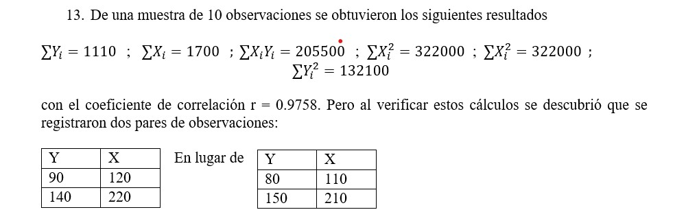

```{r setup, include=FALSE}
knitr::opts_chunk$set(echo = TRUE)
```


## Ejercicio




# Solución

El coeficiente de correlación $r$ se calcula como:

\begin{equation}
r = \frac{n \sum X_iY_i - \sum X_i \sum Y_i}{\sqrt{n \sum X_i^2 - (\sum X_i)^2}\sqrt{n \sum Y_i^2 - (\sum Y_i)^2}}
\end{equation}

donde $n$ es el número de observaciones. Sin embargo, debido a los errores mencionados, dos pares de observaciones deben ser corregidos:

(Y,X)=(90, 120) $\rightarrow$ (Y,X)=(80, 110)
(Y,X)=(140, 220) $\rightarrow$ (Y,X)=(150, 210)

Por lo tanto, los nuevos valores son:

$$\sum Y_i = 1110 - 90 - 140 + 80 + 150 = 1110 - 100 = 1110$$

$$\sum X_i = 1700 - 120 - 220 + 110 + 210 = 1700 - 20 = 1680$$

$$\sum X_iY_i = 205500 - 90 \cdot 120 - 140 \cdot 220 + 80 \cdot 110 + 150 \cdot 210 = 204200$$

$$\sum X_i^2 = 322000 - 120^2 - 220^2 + 110^2 + 210^2 = 315400$$

$$\sum Y_i^2 = 132100 - 90^2 - 140^2 + 80^2 + 150^2 = 133300$$

Sustituyendo estos valores en la fórmula original para $r$, obtenemos:

$$\begin{equation}
r = \frac{10 \cdot 204200 - 1680 \cdot 1110}{\sqrt{10 \cdot 315400 - 1680^2}\sqrt{10 \cdot 133300 - 1110^2}} = 0.9687
\end{equation}$$

Por lo tanto, el efecto de los errores en los datos es una disminución en el coeficiente de correlación de $r=0.9687$, en comparación con el valor incorrecto de $r=0.9758$.


# Aunque lo vieron en Estadística Aplicada... aqui les dejo para que recuerden "cositas" del coef. de correl.

Para demostrar cómo se llega de la fórmula para la correlación muestral a la ecuación básica de la correlación, primero vamos a expresar la fórmula para la varianza muestral de $X$ y $Y$ en términos de las sumas de cuadrados, como sigue:

$$\begin{align}
s_X^2 &= \frac{1}{n-1} \sum_{i=1}^n (X_i - \bar{X})^2 = \frac{1}{n-1} \left(\sum_{i=1}^n X_i^2 - n\bar{X}^2 \right) \
s_Y^2 &= \frac{1}{n-1} \sum_{i=1}^n (Y_i - \bar{Y})^2 = \frac{1}{n-1} \left(\sum_{i=1}^n Y_i^2 - n\bar{Y}^2 \right)
\end{align}$$

Donde $\bar{X}$ y $\bar{Y}$ son las medias muestrales de $X$ e $Y$, respectivamente.

Luego, vamos a multiplicar ambos lados de la fórmula para la correlación muestral por $\sqrt{n-1}$ para obtener:

$$\begin{equation}
\sqrt{n-1}r_{XY} = \frac{\sqrt{n-1}\sum_{i=1}^n (X_i - \bar{X})(Y_i - \bar{Y})}{\sqrt{\sum_{i=1}^n (X_i - \bar{X})^2}\sqrt{\sum_{i=1}^n (Y_i - \bar{Y})^2}}
\end{equation}$$

Luego, expandimos el numerador y simplificamos los términos:

$$\begin{align}
\sqrt{n-1}\sum_{i=1}^n (X_i - \bar{X})(Y_i - \bar{Y}) &= \sqrt{n-1} \sum_{i=1}^n X_iY_i - \sqrt{n-1}n\bar{X}\bar{Y} \
&- \sqrt{n-1}\bar{X}\sum_{i=1}^n Y_i + \sqrt{n-1}\bar{Y}\sum_{i=1}^n X_i
\end{align}$$

Luego, substituimos las fórmulas para la varianza muestral de $X$ e $Y$ en los denominadores:

$$\begin{equation}
\sqrt{n-1}r_{XY} = \frac{\sqrt{n-1}\sum_{i=1}^n X_iY_i - \sqrt{n-1}n\bar{X}\bar{Y}}{\sqrt{\frac{1}{n-1} \left(\sum_{i=1}^n X_i^2 - n\bar{X}^2 \right)}\sqrt{\frac{1}{n-1} \left(\sum_{i=1}^n Y_i^2 - n\bar{Y}^2 \right)}}
\end{equation}$$

Multiplicamos ambos lados por $\sqrt{n-1}$ nuevamente y realizamos algunas operaciones algebraicas:

$$\begin{equation}
(n-1)r_{XY} = \frac{\sum_{i=1}^n X_iY_i - n\bar{X}\bar{Y}}{\sqrt{\frac{1}{n-1} \left(\sum_{i=1}^n X_i^2 - n\bar{X}^2 \right)}\sqrt{\frac{1}{n-1} \left(\sum_{i=1}^n Y_i^2 - n\bar{Y}^2 \right)}} = \frac{n\sum_{i=1}^n X_iY_i - n\bar{X}\bar{Y}}{\sqrt{n\left(\sum_{i=1}^n X_i^2\right) - \left(\sum_{i=1}^n X_i\right)^2} \sqrt{n\left(\sum_{i=1}^n Y_i^2\right) - \left(\sum_{i=1}^n Y_i\right)^2}}
\end{equation}$$

Usando la definición de covarianza muestral:

$$\begin{equation}
s_{XY} = \frac{1}{n-1}\sum_{i=1}^n (X_i - \bar{X})(Y_i - \bar{Y}) = \frac{\sum_{i=1}^n X_iY_i - n\bar{X}\bar{Y}}{n-1}
\end{equation}$$

podemos reescribir la expresión anterior como:

$$\begin{equation}
(n-1)r_{XY} = \frac{n s_{XY}}{s_Xs_Y}
\end{equation}$$

y despejando $r_{XY}$ obtenemos:

$$\begin{equation}
r_{XY} = \frac{s_{XY}}{s_Xs_Y}\frac{n-1}{n}
\end{equation}$$

Finalmente, para obtener la ecuación básica de la correlación, multiplicamos ambos lados por $\sqrt{n}$ y reemplazamos $s_X$ y $s_Y$ por sus fórmulas:

$$\begin{align}
r &= \frac{\sqrt{n}s_{XY}}{\sqrt{n}s_Xs_Y}\frac{n-1}{n} \
&= \frac{n\sum_{i=1}^n X_iY_i - \sum_{i=1}^n X_i \sum_{i=1}^n Y_i}{\sqrt{n\sum_{i=1}^n X_i^2 - \left(\sum_{i=1}^n X_i\right)^2}\sqrt{n\sum_{i=1}^n Y_i^2 - \left(\sum_{i=1}^n Y_i\right)^2}}
\end{align}$$

que es la ecuación básica de la correlación.
